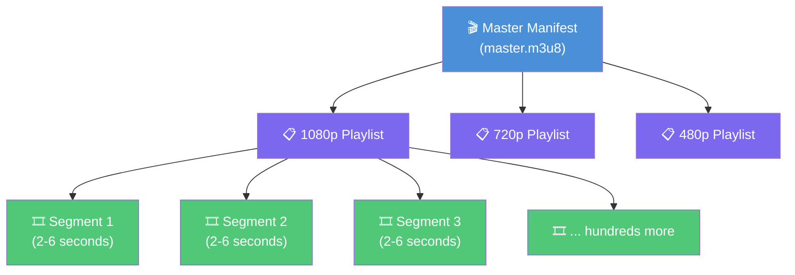
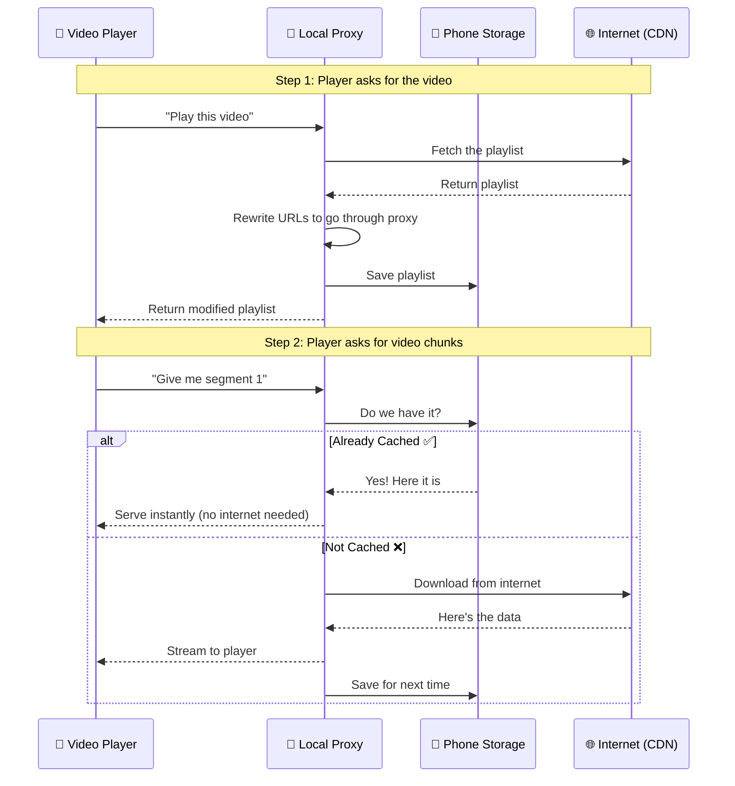
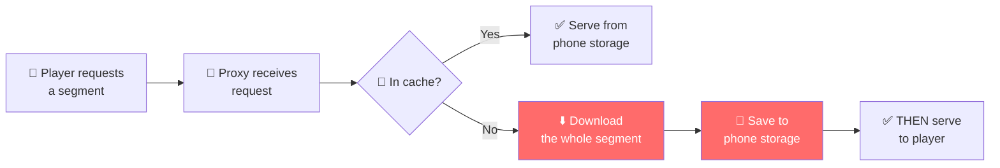
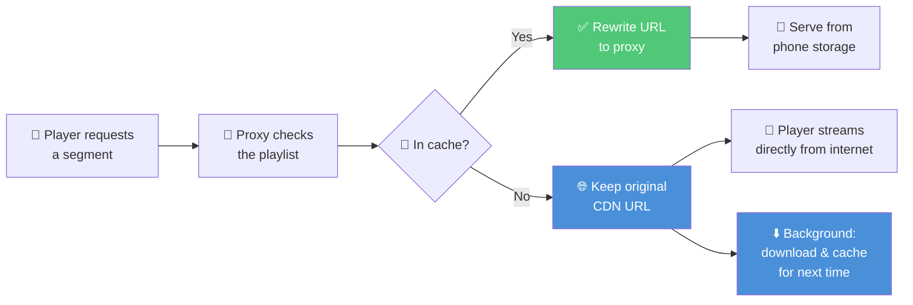
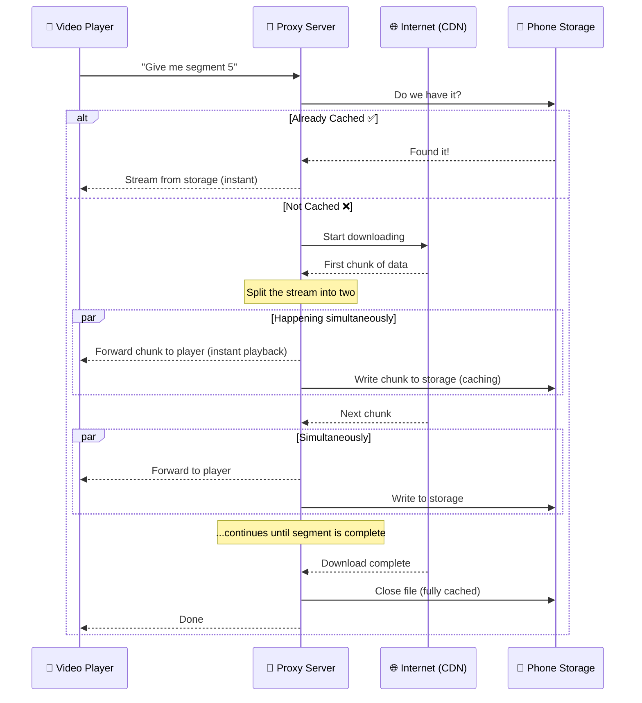
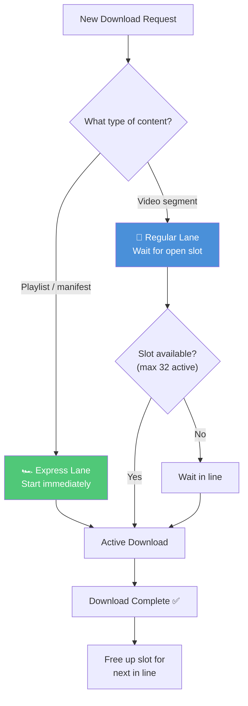

Open Instagram Reels. Swipe. The next video is already playing -- no spinner, no buffering, not even a flicker. Now turn on airplane mode and scroll back. The videos you already watched? They still play. Instantly. From your phone's storage.

That's not magic. That's **offline video caching**, and it's what separates a polished app from one that feels broken the moment you step into an elevator.

When I set out to build a Instagram-style vertical video feed in React Native, I needed that same instant-play experience. Expo SDK 52 had just shipped `expo-video`, and by SDK 53, a one-line `useCaching` prop made it trivial. MP4 files on both platforms? Cached. HLS streams on Android? Cached. HLS streams on iOS?

Nothing. No error, no warning -- just no offline playback.

I checked `react-native-video` -- same gap. The only library that tried to solve it, `react-native-video-cache`, was deprecated. There was no solution in the entire React Native ecosystem.

So I built one. [expo-video-cache](https://github.com/Monisankarnath/expo-video-cache) started as a weekend experiment and turned into three full architectural rewrites, each one solving problems the last one created. This is that story.

---

## Why HLS Is Hard to Cache

To understand the problem, you need to understand how HLS video streaming actually works -- because it's fundamentally different from what most people picture when they think of a "video file."

**An MP4 is a single file.** Think of it like a PDF: one file, one download. Caching it is trivial -- save the file, play from disk. Done.

**HLS is not a file. It's a recipe.** When your app requests a `.m3u8` URL, it doesn't get a video -- it gets a tiny text file (a few kilobytes) that says _"here are the ingredients and where to find them."_ It's like ordering a meal and receiving a shopping list instead of food.



A 5-minute video might have a master manifest, 3 quality playlists, and **150+ tiny segment files**. To cache HLS, you have to download and store _every single one_ of those segments -- not just the `.m3u8` link.

On Android, this is a solved problem. The native player (ExoPlayer) handles all of this internally. But on iOS, AVPlayer is built for _streaming_, not storing. Apple does provide `AVAssetDownloadTask` for offline HLS, but it's designed for long-form content -- downloading a movie on Netflix for a flight. Not what you need when you're trying to pre-cache the next 3 videos in a feed that users scroll through in seconds.

I needed to make AVPlayer _think_ it was streaming from the internet -- while actually serving content from the phone's storage.

---

## The Solution: A Local Proxy Server

Since I couldn't make AVPlayer cache HLS natively, I decided to **trick** it.

Imagine a translator sitting between you and someone who speaks a different language. You talk to the translator, the translator talks to the other person, and you never know the difference. That's exactly what a **local proxy server** does -- it's a tiny web server running right on the device (localhost) that sits between the video player and the internet.

Instead of giving the player the real video URL:

```
https://cdn.example.com/stream/master.m3u8
```

I give it a URL pointing to my proxy:

```
http://127.0.0.1:9000/proxy?url=https%3A%2F%2Fcdn.example.com%2Fstream%2Fmaster.m3u8
```

AVPlayer thinks it's streaming from a normal web server. It has no idea the "server" is running on the same phone. Behind the scenes, the proxy intercepts every request, checks local storage, and either serves the content from cache or fetches it from the real server and saves a copy.

The critical trick is **manifest rewriting**. When the proxy downloads an HLS playlist, it opens the text file and rewrites every URL inside it to also point through the proxy. This ensures that _all_ subsequent requests -- every segment, every sub-playlist -- are also intercepted and cached.



The module works across all platforms with a single API:

- **iOS**: The proxy server intercepts and caches HLS traffic.
- **Android**: Returns the original URL unchanged -- ExoPlayer already handles HLS caching natively.
- **Web**: Returns the original URL -- browser caching does the job.

One function call. Three platforms. The developer never thinks about it.

---

## The First Attempt

For the first version, I used a lightweight Swift HTTP server library called Swifter to handle the proxy. The logic was simple:



**Download the whole thing, save it, then serve it.** For every single segment. The player had to wait for the complete download-and-save cycle before it could see a single frame.

On Wi-Fi, this worked fine. Segments are small (2-6 seconds of video, a few megabytes), so they download quickly. I had working HLS caching on iOS for the first time -- offline playback, instant replay of previously-watched content, automatic cache management. It was exciting.

**Then I tested on a real mobile network.**

On 4G with moderate latency, I could _feel_ the pauses between segments. The player would freeze for a beat, waiting for the proxy to finish downloading the next chunk. On 3G, it was worse -- the pauses stacked up into a stuttering, stop-and-go experience. It was actually _worse_ than just streaming directly without caching.

The architecture had a fundamental bottleneck: every byte had to complete a round trip (download to proxy, save to disk, read from disk, serve to player) before the video could play it.

---

## The Optimization

The second iteration flipped the approach: **let the player stream directly from the internet on first play**, and cache content silently in the background for next time.



The key was in how the proxy rewrote the manifest:

- **Cached segments** -- URL rewritten to the local proxy (instant playback from storage)
- **Uncached segments** -- Original internet URL left as-is (player fetches directly from CDN, zero delay)

Meanwhile, the proxy kicked off background downloads for every uncached segment. So while the user watched the video streamed live from the internet, every segment was being silently saved. The next time they played the same video, everything would come from cache -- instant and offline-ready.

The trade-off was intentional: on first play, uncached segments were downloaded _twice_ -- once by the player (for immediate playback) and once by the cacher (for storage). Double the bandwidth, but the alternative was the stuttering mess of the first attempt. Users don't notice bandwidth. They absolutely notice buffering.

I also added **network monitoring** with a circuit breaker. On mobile data, if the connection dropped (elevator, tunnel, dead zone), the background downloader would keep hammering failed requests, draining battery and eating through data. The circuit breaker detected the first failure and halted all background downloads until the connection came back.

**This worked beautifully for single videos.** But then I tested it in a vertical feed with 5 videos prefetching at once. Each HLS stream needs ~50 segments. That's ~250 concurrent download requests. The phone's network stack choked: **Connection Refused errors everywhere.** The OS was overwhelmed.

There was also disk bloat -- users scrolled past videos in 2 seconds, but the background cacher was downloading _entire_ streams for each one.

---

## The Rewrite

The third iteration was a ground-up rewrite with three goals:

1. **Don't download twice.** Stream data to the player AND save it to disk at the same time.
2. **Don't crash the network.** Control how many downloads happen at once.
3. **Drop the external dependency.** Replace the third-party HTTP server with native Apple APIs (zero added binary size).

### Stream-While-Downloading

This was the breakthrough. Instead of download-then-serve (first attempt) or stream-from-CDN-and-cache-separately (optimization), this approach **splits a single download stream into two destinations simultaneously**:



**One download. Zero waiting. Zero waste.** The player sees the first bytes of video data within milliseconds -- as fast as streaming directly from the internet -- while caching happens invisibly as a side effect.

Think of it like this: imagine you're copying a friend's notes in class. In the first attempt, you'd borrow the notebook, photocopy every page, then read from the copies. Slow. In the optimization, you'd read the original notebook while a friend photocopied it for you -- fast, but you needed two people. In the rewrite, you're reading the notebook with one hand and writing a copy with the other. One source, two outputs, no waiting.

### Smart Download Management

To prevent the "250 concurrent downloads crashing the network" problem from the optimization, I built a **traffic controller** for downloads:



Think of it like a highway with an express lane:

- **Express lane**: Playlists and critical startup files always get through immediately. These are tiny but essential -- without them, the video can't even begin to play.
- **Regular lane**: Video segments queue up and are processed in order, with a cap on how many can download at once.

This means even when 5 videos are prefetching simultaneously, a _new_ video's playlist loads instantly. The user is never waiting for a download queue to drain before playback can start.

### What Changed Under the Hood

I replaced the third-party Swifter library with a custom server built on Apple's own networking framework. This eliminated **~2.5MB** from the binary size (making the library's footprint essentially zero) and gave me complete control over connections, concurrency, and error handling.

---

## Real-World Performance

I tested the library on real devices and real networks to understand the actual impact on the user experience. Here's what I measured for initial video load time (the moment the user sees the first frame):

### On Slow Mobile Data (~7 Mbps)

| Scenario                                     | Load Time |
| -------------------------------------------- | --------- |
| With expo-video-cache, **no previous cache** | ~2300ms   |
| Without expo-video-cache (direct streaming)  | ~1600ms   |
| With expo-video-cache, **content cached**    | ~1600ms   |

On a first-ever play over slow mobile data, the proxy adds ~700ms of overhead while it fetches and processes the manifest. But once the content is cached, subsequent plays match or beat direct streaming speed -- and work completely offline.

### On Wi-Fi / Fast Mobile Data

| Scenario                 | Load Time                |
| ------------------------ | ------------------------ |
| With expo-video-cache    | No noticeable difference |
| Without expo-video-cache | No noticeable difference |

On fast connections, the proxy's overhead is invisible. The real value shows up on the _second_ play and in offline scenarios -- exactly the situations that matter most in a scroll-heavy feed.

### The Big Picture

|                                | First Attempt              | Optimization                          | Rewrite                           |
| ------------------------------ | -------------------------- | ------------------------------------- | --------------------------------- |
| **How it works**               | Download, save, then serve | Stream from CDN + cache in background | Stream to player AND disk at once |
| **First-play feel**            | Stuttering on mobile data  | Smooth (but uses 2x bandwidth)        | Smooth (single download)          |
| **Added app size**             | ~2.5MB                     | ~2.5MB                                | ~0 (native APIs only)             |
| **Feed scrolling (5+ videos)** | Works                      | Works                                 | Stable                            |

---

## Using It In Your App

The API is three functions. Here's how to integrate it with a vertical video feed.

### 1. Start the Server

Start it once when the app opens. It runs for the app's entire lifecycle.

```typescript
// App.tsx
import { useEffect, useState } from "react";
import { View, ActivityIndicator } from "react-native";
import * as VideoCache from "expo-video-cache";

export default function App() {
  const [isReady, setIsReady] = useState(false);

  useEffect(() => {
    const init = async () => {
      try {
        await VideoCache.startServer(9000, 1024 * 1024 * 1024); // Port 9000, 1GB cache limit
        setIsReady(true);
      } catch (e) {
        console.error("Failed to start server", e);
        setIsReady(true); // Graceful degradation -- videos play uncached
      }
    };
    init();
  }, []);

  if (!isReady) {
    return (
      <View style={{ flex: 1, justifyContent: "center", alignItems: "center" }}>
        <ActivityIndicator size="large" />
      </View>
    );
  }

  return <Stream />;
}
```

### 2. The Smart Source Helper

This one function handles all the platform logic. On iOS, it routes through the proxy. On Android, it uses the native player's built-in caching. No `if/else` needed in your components.

```typescript
import { Platform } from "react-native";
import * as VideoCache from "expo-video-cache";

export const getVideoSource = (url: string) => ({
  // iOS: Rewrite to localhost proxy | Android: Keep original URL
  uri: Platform.OS === "android" ? url : VideoCache.convertUrl(url),
  // iOS: Disable native caching (proxy handles it) | Android: Enable native caching
  useCaching: Platform.OS === "android",
});
```

**Why `useCaching: false` on iOS?** The proxy is already caching every segment of the m3u8. You can use `useCaching: false` when it is a mp4 or mov.

### 3. Build the Vertical Feed

Use the helper in your components. The platform logic is invisible:

```typescript
export default function Stream() {
  const videoSources = useMemo(
    () => rawVideoData.map((item) => getVideoSource(item.uri)),
    []
  );

  return (
    <FlatList
      data={videoSources}
      renderItem={({ item }) => <VideoItem source={item} />}
      pagingEnabled
      windowSize={3}
      initialNumToRender={1}
      maxToRenderPerBatch={2}
    />
  );
}
```

```typescript
export default function VideoItem({ source, isActive, height }) {
  const player = useVideoPlayer(source, (player) => {
    player.loop = true;
    player.muted = true;
  });

  useEffect(() => {
    if (isActive) player.play();
    else player.pause();
  }, [isActive]);

  return (
    <Pressable onPress={() => setIsMuted((m) => !m)} style={{ height, width }}>
      <VideoView style={{ flex: 1 }} player={player} nativeControls={false} />
    </Pressable>
  );
}
```

### Platform Compatibility

| Platform    | How It Works                                           |
| ----------- | ------------------------------------------------------ |
| **iOS**     | Local proxy intercepts, caches, and serves HLS content |
| **Android** | Uses native ExoPlayer caching (no proxy needed)        |
| **Web**     | Returns original URL, relies on browser caching        |

---

## Challenges and Caveats

### The MP4 Trap

Early on, I tried routing _everything_ through the proxy, including standard MP4 files. Bad idea. The proxy is built for HLS, where segments are small (2-6MB) and arrive quickly. A 500MB MP4 movie is a completely different beast. Use `expo-video`'s native `useCaching` for MP4s -- the native player handles large files much better.

### The Race Condition

There's a subtle timing issue: the React Native UI can mount and call `convertUrl()` before the server has finished starting (~10-50ms). If this happens, `convertUrl()` returns the _original_ remote URL as a safety fallback. The video plays from the internet (uncached) rather than crashing. This is why the `await startServer()` pattern matters -- wait for the server before rendering the feed.

### DRM Content

This approach rewrites the URLs inside HLS playlist files. DRM systems like Apple's FairPlay use digital signatures to verify that playlists haven't been tampered with. Rewriting them breaks the signature. This library is strictly for non-DRM (clear) HLS content.

---

## What's Next

The library is stable and published on npm, but there's one feature I'm particularly excited to build:

**Head-Only Smart Caching** -- In a vertical feed like Instagram Reels, most users swipe past a video within a few seconds. Right now, the proxy caches every segment the player requests. But what if I only cached the first 10-15 seconds of each video? The opening plays instantly from cache (or offline), and the rest streams from the internet on demand. Users who watch the full video get seamless streaming. Users who swipe away don't waste storage on content they'll never replay. This could dramatically reduce disk usage without sacrificing the instant-play experience.

---

_expo-video-cache is open-source and available on [npm](https://www.npmjs.com/package/expo-video-cache) and [GitHub](https://github.com/Monisankarnath/expo-video-cache). If you're building video feeds in React Native and struggling with HLS caching on iOS, give it a try._
