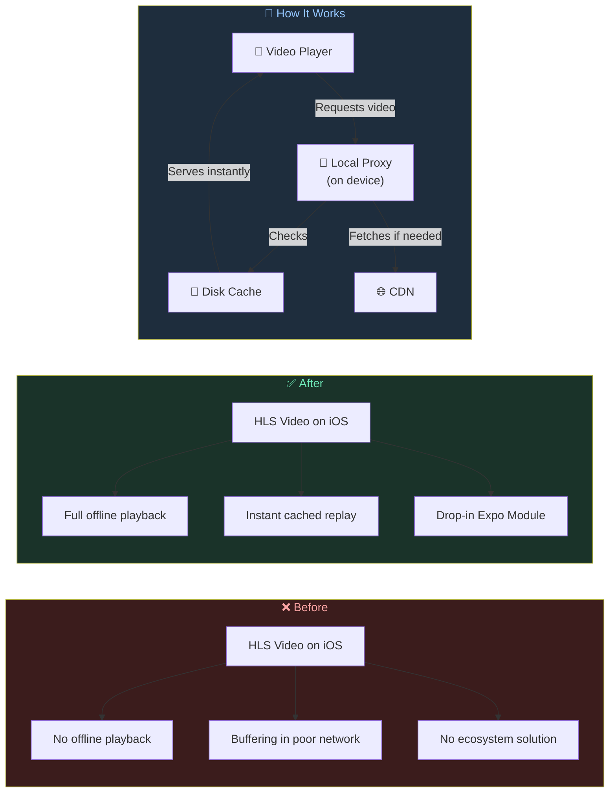

---

## Project Overview

|                |                                                                                                  |
| -------------- | ------------------------------------------------------------------------------------------------ |
| **What**       | An open-source Expo Module that enables offline HLS video caching on iOS for React Native apps   |
| **Tech Stack** | Swift, Kotlin, TypeScript, Expo Modules API                                                      |
| **Platforms**  | iOS (active proxy), Android (passthrough), Web (shim)                                            |
| **Iterations** | 3 complete architectural rewrites over the course of development                                 |
| **Scope**      | Open-source npm package, published and community-used                                            |
| **Repository** | [github.com/Monisankarnath/expo-video-cache](https://github.com/Monisankarnath/expo-video-cache) |
| **npm**        | [expo-video-cache](https://www.npmjs.com/package/expo-video-cache)                               |

---

## The Challenge

### What I Was Building

A **vertical video feed** -- the kind you see on Instagram Reels or TikTok. Users swipe up, the next video plays instantly. Swipe again, instant. The expectation is simple: zero buffering, zero loading spinners, ever. Even in an elevator. Even in airplane mode.

To deliver that experience, you need **offline caching**. The app must pre-download the next few videos in the feed before the user scrolls to them. When a user revisits a video, it should play from local storage without touching the network.

### The Technology: HLS (HTTP Live Streaming)

Most production video feeds don't use plain MP4 files. They use **HLS** -- Apple's streaming protocol adopted across the industry. Understanding why HLS is hard to cache is essential to understanding everything I built.

**MP4 is simple.** One file, one download. Cache it by saving the file to disk and pointing the player at the local path.

**HLS is a tree of files.** When you request a `.m3u8` URL, you don't get a video. You get a tiny text file -- a manifest -- that lists other files. Those files may list more files. The actual video data is buried several layers deep in hundreds of tiny segment files.

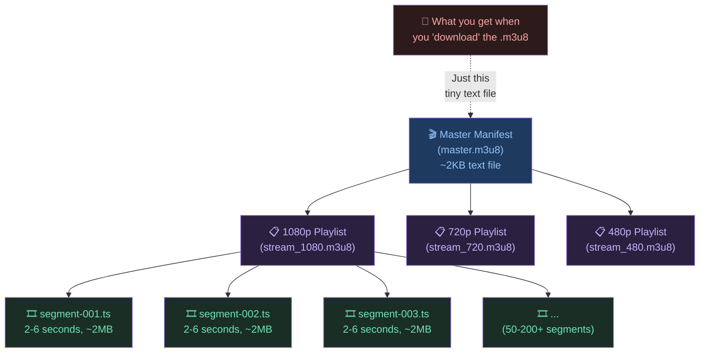

A single 5-minute video at 1080p might have: 1 master manifest, 3 quality-level playlists, and **150+ segment files**. To cache that video for offline playback, you need to download and store every single one of those files, and you need the manifests to point to the local copies instead of the remote URLs.

### The Ecosystem Gap

When I started building the feed, the ecosystem looked promising:

- **Expo SDK 52** had just shipped `expo-video` (replacing the aging `expo-av`).
- **Expo SDK 53** stabilized a `useCaching` prop -- one line of code to enable native caching.
- **Android** worked perfectly. ExoPlayer (the native Android player) handles HLS caching internally.

**iOS was the problem.** Apple's AVPlayer is designed for streaming, not storing. The `useCaching` prop works for MP4 files on iOS, but for HLS? Nothing happens. No error, no warning -- just no offline playback.

I researched alternatives:

| Option                        | Status           | Problem                                                                               |
| ----------------------------- | ---------------- | ------------------------------------------------------------------------------------- |
| `expo-video` useCaching       | Stable (SDK 53+) | Doesn't work for HLS on iOS                                                           |
| `react-native-video`          | Active           | Same HLS gap on iOS                                                                   |
| `react-native-video-cache`    | **Deprecated**   | Unmaintained, poor performance                                                        |
| Apple's `AVAssetDownloadTask` | Native API       | Designed for long-form downloads (movies for flights), not instant short-form caching |
| Build it myself               | ---              | ---                                                                                   |

There was no solution in the React Native ecosystem. So I built one.

### The Core Idea

Since AVPlayer won't cache HLS content, I'd **trick** it. I'd run a tiny web server _on the device itself_ -- a localhost proxy. Instead of giving the player the real video URL, I'd give it a URL pointing to my proxy. The proxy would handle all the caching transparently. AVPlayer would think it's streaming from a normal server. It would never know the "server" is running on the same phone.

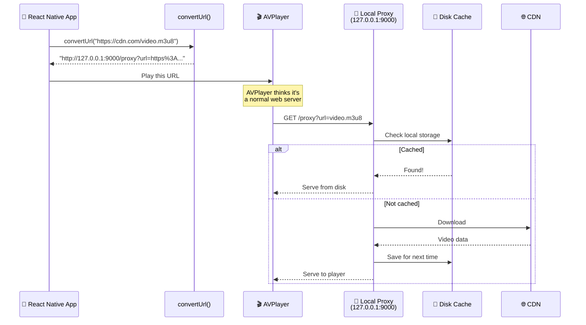

The critical technique is **manifest rewriting**. When the proxy downloads an HLS playlist, it opens the text file and rewrites every URL inside to also route through the proxy. This ensures that every subsequent request -- sub-playlists, segments, audio tracks, encryption keys -- is also intercepted and cached.

### Three-Platform Strategy

I designed the module with platform-aware behavior from the start:

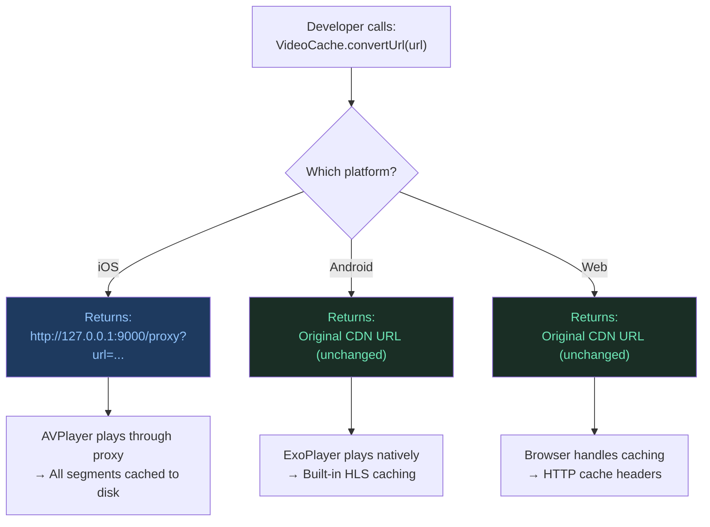

The public API is three functions, identical across platforms:

```typescript
// Start the proxy server (iOS) or no-op (Android/Web)
await startServer(9000, 1024 * 1024 * 1024); // port, max cache size (1GB)

// Rewrite URL to localhost (iOS) or return original (Android/Web)
const localUrl = convertUrl("https://cdn.example.com/video.m3u8");

// Clear disk cache (iOS) or no-op (Android/Web)
await clearCache();
```

One API surface. Three optimized strategies. The developer never writes a platform check.

---

## The First Attempt

### The Approach

For the initial implementation, I needed an HTTP server that could run on an iOS device. I evaluated two options:

| Library          | Language    | Size    | Style               | Decision                                    |
| ---------------- | ----------- | ------- | ------------------- | ------------------------------------------- |
| **GCDWebServer** | Objective-C | Heavier | Older API patterns  | Rejected -- older style, heavier            |
| **Swifter**      | Pure Swift  | ~2.5MB  | Modern, lightweight | **Chosen** -- modern Swift, small footprint |

Swifter was a lightweight, pure-Swift HTTP server library. It let me spin up a server in a few lines of code and register route handlers with closures. The trade-off was a ~2.5MB addition to the app binary -- acceptable for a first version.

### The Architecture

The architecture was straightforward -- a single `/proxy` route that handled everything:

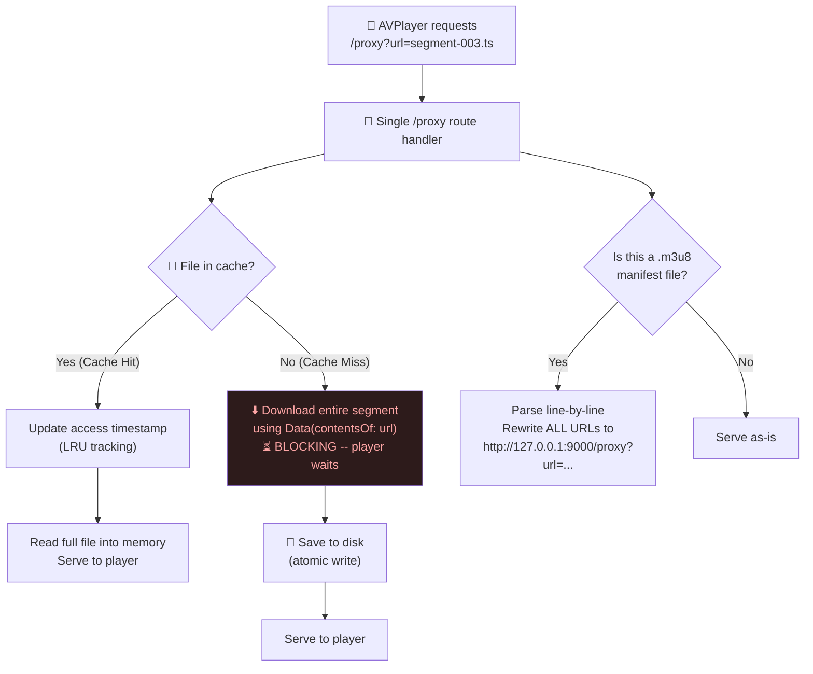

**The data flow was simple:** For every request, check the cache. If the file exists, serve it. If not, download the entire thing, save it to disk, then serve it. For `.m3u8` manifests, parse line-by-line and rewrite all internal URLs to route through the proxy.

### Key Implementation Details

**Cache storage** used SHA256 hashing of the URL to generate filesystem-safe filenames. A 64-character hex string, collision-resistant and deterministic:

```swift
// "https://cdn.example.com/segment-001.ts"
// → "a4f2e8c9d3b1..." (64 chars) + ".ts"
let hash = SHA256.hash(data: Data(urlString.utf8))
let filename = hash.map { String(format: "%02x", $0) }.joined()
```

**LRU (Least Recently Used) pruning** was based on file modification dates. Every time a cached file was read, its modification date was updated to "now" -- touching it. When the cache exceeded the size limit, the oldest-touched files were deleted first:

```swift
func prune() {
    // Sort all cached files by modification date (oldest first)
    let sorted = files.sorted { $0.modificationDate < $1.modificationDate }
    // Delete oldest files until we're under the limit
    while totalSize >= maxCacheSize {
        deleteFile(sorted.removeFirst())
        totalSize -= deletedFileSize
    }
}
```

**Manifest rewriting** parsed every line of the `.m3u8` file. URLs could appear in three forms -- and I had to handle all of them:

```
# Standard segment URL (relative)
segment-001.ts

# Standard segment URL (absolute)
https://cdn.example.com/segment-001.ts

# URL inside an HLS tag attribute
#EXT-X-KEY:METHOD=AES-128,URI="https://cdn.example.com/key.php"
```

Each was resolved to an absolute URL, percent-encoded, and wrapped in a proxy URL: `http://127.0.0.1:9000/proxy?url=https%3A%2F%2Fcdn.example.com%2Fsegment-001.ts`

**HTTP Range requests** were essential. AVPlayer frequently requests specific byte ranges of a file (e.g., `Range: bytes=0-1024`). The proxy had to parse these headers and respond with `HTTP 206 Partial Content` and the correct `Content-Range` header. Without this, seeking would break.

### The iOS File Structure

Three Swift files, clean separation:

```
ios/
├── ExpoVideoCacheModule.swift    → Expo Module bridge (JS ↔ Native)
├── VideoProxyServer.swift        → HTTP proxy server (Swifter-based)
├── VideoCacheStorage.swift       → Disk cache + LRU pruning
└── ExpoVideoCache.podspec        → Depends on Swifter ~> 1.5.0
```

### What Worked

- **First working HLS cache on iOS in the Expo ecosystem.** No other library did this.
- **Offline playback.** Previously-watched content played without any network connection.
- **LRU cache management.** Disk usage stayed bounded. Old content was automatically evicted.
- **Graceful degradation.** If the server wasn't ready when `convertUrl()` was called, it returned the original remote URL. The video played uncached rather than crashing.

### What Broke: Testing on Real Mobile Networks

On Wi-Fi, the experience was good. Segments are small (2-6MB), they download in milliseconds, and the player barely notices the proxy.

**Then I tested on 4G mobile data.**

The pauses were immediately noticeable. Between every segment, there was a beat -- a micro-stall where the player waited for the proxy to finish downloading the next chunk. On 3G, it was much worse. The pauses stacked into a stuttering, stop-and-go experience that was _worse_ than streaming directly from the CDN without any caching.

The root cause was architectural:

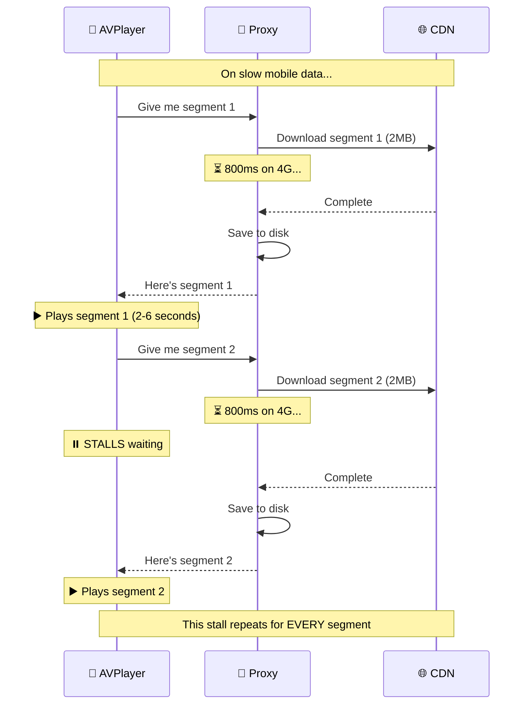

**Every byte had to pass through the proxy's download → save → serve pipeline.** The player was held hostage at every step. Without the proxy, AVPlayer would have been streaming directly from the CDN and buffering ahead intelligently. The proxy was creating a bottleneck where none existed before.

---

## The Optimization

### The Problem to Solve

The first attempt proved the concept -- HLS caching on iOS worked. But the download-then-serve model made first-play performance worse than direct streaming on mobile networks. I needed to eliminate the latency on first play while still caching content for offline replay.

### The Key Insight: Don't Proxy What You Don't Have

The breakthrough was simple: **don't route uncached content through the proxy.** If a segment isn't in the cache, let the player stream it directly from the CDN at full speed. Cache it in the background for next time.

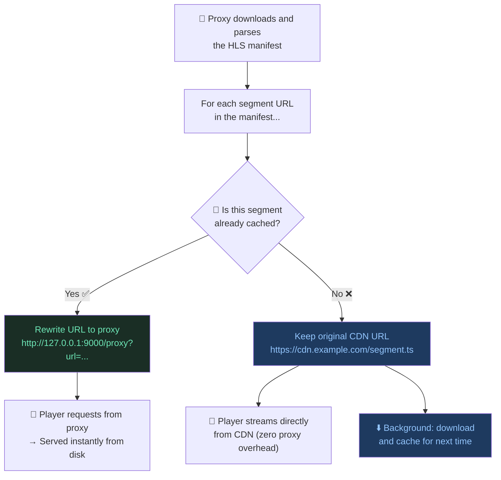

This was the **Hybrid Strategy**: CDN-first streaming with background caching. The manifest rewriting became conditional:

```swift
// THE core change -- inside the manifest rewriting function
if self.storage.exists(for: absoluteUrlString) {
    // Cached → route through proxy (serve from disk instantly)
    return "http://127.0.0.1:\(self.port)/proxy?url=\(encoded)"
} else {
    // Not cached → keep original CDN URL (player streams directly)
    // AND cache it in the background for next time
    self.downloadInBackground(url: absoluteUrlString)
    return absoluteUrlString  // Original CDN URL, untouched
}
```

**The end-to-end flow for first play:**

1. Player requests master manifest → proxy fetches, caches, rewrites it.
2. Inside the manifest, each segment URL is checked against the disk cache.
3. Cached segments → URL points to proxy → served instantly from disk.
4. Uncached segments → original CDN URL left in manifest → AVPlayer streams directly from CDN at full speed.
5. For each uncached segment, `downloadInBackground()` fires concurrently → silently saves to disk.
6. On second play, all segments are now cached → all URLs point to proxy → instant offline playback.

### The Conscious Trade-off: Double Bandwidth

This created a trade-off I accepted deliberately: on first play, every uncached segment was downloaded _twice_. Once by AVPlayer (direct CDN stream for immediate playback) and once by the background cacher (saving to disk for next time).

| Metric                  | First Attempt            | Optimization         |
| ----------------------- | ------------------------ | -------------------- |
| First-play latency      | Stalls between segments  | Zero (CDN-direct)    |
| Bandwidth on first play | 1x (but blocks playback) | 2x (double download) |
| Second-play speed       | Instant from cache       | Instant from cache   |

I was doubling bandwidth for first play. But the alternative -- the stuttering, pausing experience of the first attempt -- was far worse. Bandwidth is cheap. User patience is not.

### Network Monitoring and Circuit Breaker

On mobile data, a new problem appeared: when the network dropped (elevator, tunnel, dead zone), the background downloader kept firing requests into the void. Hundreds of `URLSession` tasks would queue up, consuming battery, hogging memory, and then flooding the network with retries the moment connectivity returned -- consuming mobile data in a burst.

I added Apple's `NWPathMonitor` for real-time connectivity detection and a **circuit breaker** pattern:

```swift
private let monitor = NWPathMonitor()
private var isConnected: Bool = true
private var isOfflineCircuitBreakerOpen: Bool = false

// When a download fails with error code -1009 (no internet):
if let error = error as NSError?, error.code == -1009 {
    self.isOfflineCircuitBreakerOpen = true  // Trip the breaker
    return  // Stop all further download attempts
}

// When network recovers (detected by NWPathMonitor):
// Circuit breaker resets automatically
```

The circuit breaker tripped on the _first_ network failure and halted _all_ background downloads. No retries, no queue buildup. When the monitor confirmed the network was back, downloads resumed normally.

### Other Improvements

**FileHandle-based serving** replaced loading entire files into memory. For cached segments, the proxy now opened a `FileHandle`, sought to the requested byte offset, and read only the bytes needed. This was critical for fMP4 streams where AVPlayer makes many small byte-range requests to initialization segments -- loading a 5MB file to serve 1KB would be wasteful.

```swift
// Before (First Attempt): Load entire file into memory
let data = try Data(contentsOf: fileUrl)  // Entire file in RAM

// After (Optimization): Read only what's needed
let handle = try FileHandle(forReadingFrom: fileUrl)
handle.seek(toFileOffset: rangeStart)  // Jump to the right position
let data = handle.readData(ofLength: rangeLength)  // Read only the slice
handle.closeFile()
```

**Throttled background session** limited concurrent downloads to 4 per host with a 30-second timeout, preventing the downloader from overwhelming the CDN or the device.

**Delayed cache pruning** -- pruning now waited 10 seconds after server start, avoiding disk I/O contention during the critical startup window when manifests and first segments are being fetched.

**Empty file self-healing** -- if a cached file existed but was empty (corrupt from a crash during write), it was automatically deleted rather than served. This prevented "poisoned" cache entries from blocking future downloads.

### What Worked

- **First-play latency eliminated.** Playback was as fast as raw CDN streaming.
- **Offline replay.** Previously-watched content played from cache.
- **Network resilience.** Circuit breaker prevented battery drain and data waste during outages.
- **Memory efficiency.** FileHandle serving avoided loading entire files into RAM.

### What Broke: The Vertical Feed

**This worked beautifully for single-video playback.** But a TikTok-style feed doesn't play one video at a time -- it prefetches.

When I tested with 5 videos prefetching simultaneously, each HLS stream had ~50 segments. That's roughly **250 concurrent download requests** hitting the network stack. The OS ran out of TCP sockets:

```
Error: Socket Error 61 -- Connection Refused
```

**Every video in the feed stopped playing.** The network layer was completely overwhelmed.

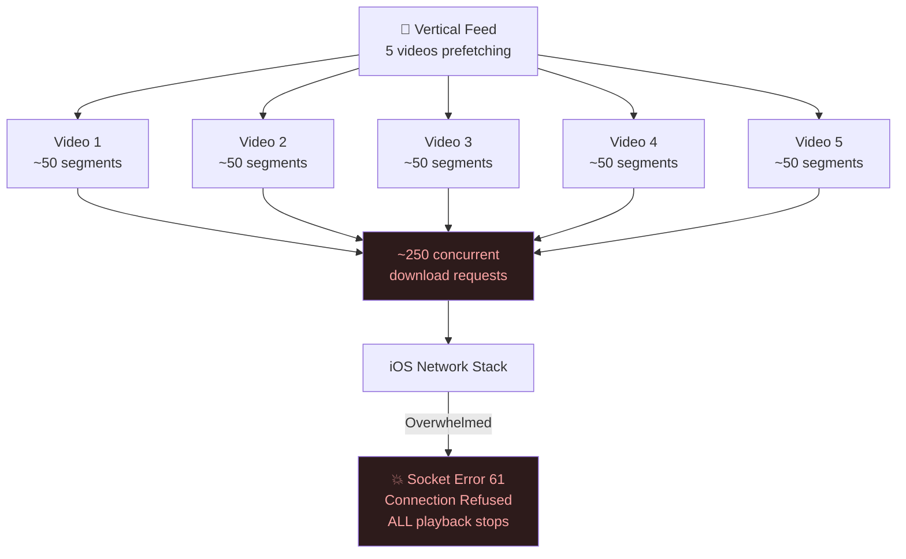

There was also **disk bloat**. Users scrolled past videos in 2 seconds, but the background cacher was downloading _entire_ streams for each one -- 50+ segments per video, megabytes of content the user would never watch. The cache filled with unwatched content, triggering aggressive LRU pruning that evicted videos the user actually cared about.

And the ~2.5MB Swifter dependency was starting to feel heavy for a utility library.

I needed a fundamentally different architecture.

---

## The Rewrite

### Three Hard Requirements

The third iteration wasn't incremental. It was a ground-up rewrite driven by three production-grade requirements:

1. **Eliminate Socket Error 61.** I needed strict control over how many network connections were active at any time.
2. **Eliminate the ~2.5MB Swifter dependency.** Build the server on Apple's native networking framework.
3. **Stream data to the player while saving to disk simultaneously.** No double download (optimization's waste), no waiting (first attempt's latency).

### Replacing Swifter with Apple's Network Framework

I threw out the Swifter library entirely and built a custom TCP server using Apple's native `Network` framework -- `NWListener` for accepting connections and `NWConnection` for handling each client.

This gave me:

- **Zero third-party dependencies** -- only Apple frameworks and ExpoModulesCore.
- **Full control** over connection lifecycle, concurrency, and error handling.
- **~2.5MB smaller** app binary.

### The New Architecture: 6 Files, Clear Separation

The iOS code went from 3 files to 6. Each file has a single, well-defined responsibility:

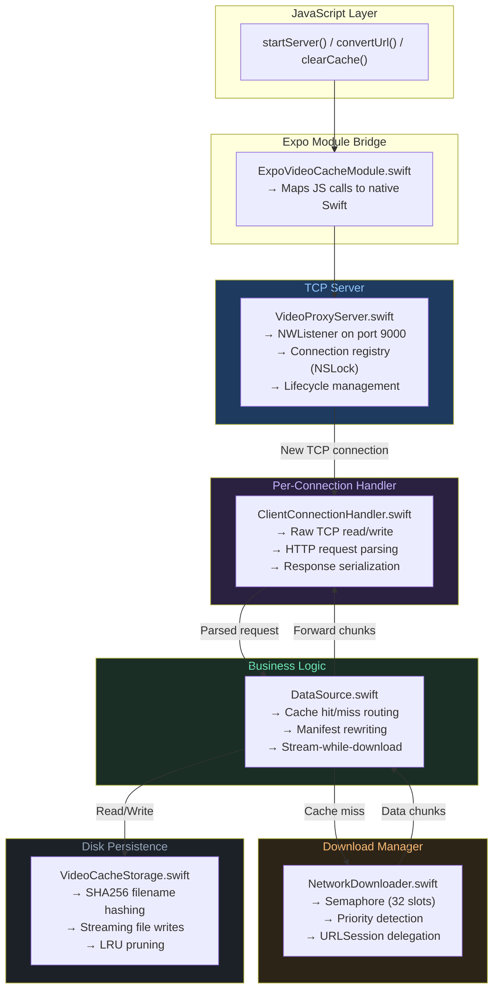

| File                            | Lines | Responsibility                                                                              |
| ------------------------------- | ----- | ------------------------------------------------------------------------------------------- |
| `VideoProxyServer.swift`        | ~120  | TCP listener lifecycle, connection registry with `NSLock`, server start/stop                |
| `ClientConnectionHandler.swift` | ~150  | Raw TCP I/O, HTTP header parsing, response serialization. One instance per connection       |
| `DataSource.swift`              | ~250  | The brain: cache routing, manifest rewriting, stream-while-download orchestration           |
| `NetworkDownloader.swift`       | ~200  | Download scheduling, semaphore concurrency, two-lane priority system, URLSession delegation |
| `VideoCacheStorage.swift`       | ~120  | Disk persistence, SHA256 hashing, streaming writes, LRU pruning                             |
| `ExpoVideoCacheModule.swift`    | ~80   | Expo Module bridge (JS ↔ Swift)                                                             |

### Innovation #1: Stream-While-Downloading

This was the defining innovation. Instead of download-then-serve (first attempt) or CDN-direct + background-cache (optimization), the rewrite **splits a single download stream into two destinations at the same time**:

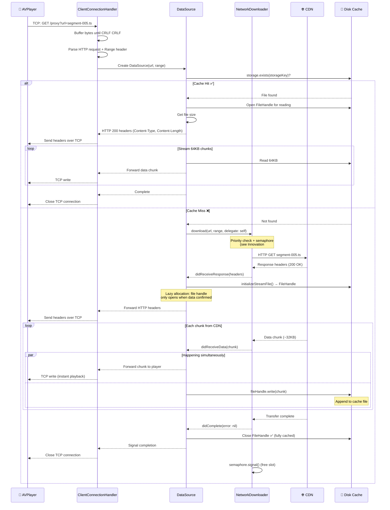

**One download. Zero waiting. Zero waste.**

The player sees the first byte of video data within milliseconds of the CDN responding -- identical to streaming directly from the internet. The cache file is populated as a side effect. No double download (optimization's waste eliminated). No waiting for the full segment (first attempt's latency eliminated).

**Error handling**: If the download fails mid-stream, the partial cache file is immediately **deleted** to prevent serving corrupt data on future cache hits:

```swift
func didComplete(task: NetworkTask, error: Error?) {
    fileHandle?.closeFile()
    fileHandle = nil
    if error != nil {
        storage.delete(for: storageKey)  // Clean up partial file
    }
    delegate?.didComplete(error: error)
}
```

### Innovation #2: Semaphore-Based Concurrency with Priority Lanes

To prevent Socket Error 61, I built a download manager with two key mechanisms:

**A semaphore** that limits concurrent heavy downloads to 32. This is a hard cap on active network connections:

```swift
private let semaphore = DispatchSemaphore(value: 32)
private let queue = DispatchQueue(label: "com.videocache.downloader") // Serial!
```

**A two-lane priority system** that classifies every download request:

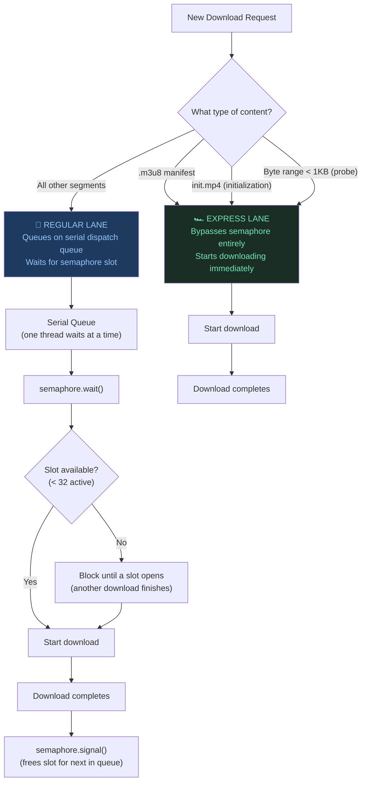

**Why the express lane matters:** Manifests and initialization segments are tiny but _essential_. Without the manifest, the player can't even begin. Without the init segment, no media data can decode. If these were stuck behind 32 queued segment downloads, playback startup would stall. The express lane ensures they execute immediately, no matter how saturated the download queue is.

**Why a serial dispatch queue:** The semaphore's `.wait()` call blocks the calling thread. If I dispatched each download to a concurrent queue, every waiting download would block its own GCD thread. With 200 queued segments, that's 200 blocked threads -- enough to exhaust the GCD thread pool. The serial queue ensures only _one_ thread is blocked at a time, and downloads are processed in strict FIFO order.

**Why 32?** I researched common values and settled on 32 as a balanced default -- high enough for good throughput (multiple videos loading segments in parallel), low enough to stay well within iOS's TCP socket limits. The `httpMaximumConnectionsPerHost` on the URLSession is also set to 32 to match. This value could be refined further through device-specific benchmarking.

### Innovation #3: Lazy File Handle Allocation

In a vertical feed, rapid scrolling can queue hundreds of segment requests. If each request immediately opened a file handle for cache writing, the OS would run out of file descriptors and crash.

The fix: **file handles are only opened when data actually starts arriving**:

```swift
func didReceiveResponse(task: NetworkTask, response: URLResponse) {
    let httpResponse = response as! HTTPURLResponse
    if (200...299).contains(httpResponse.statusCode) {
        // Data is confirmed coming -- NOW open the file handle
        self.fileHandle = storage.initializeStreamFile(for: storageKey)
    }
}
```

Before this callback fires, no file handle exists. If the request is cancelled while waiting in the semaphore queue, or if the server returns an error, no file descriptor is consumed. The system stays lightweight even under extreme load.

### Innovation #4: Range-Aware Cache Keys

Fragmented MP4 (fMP4) -- the modern HLS format used by most CDNs -- has a quirk: the **same URL** is used for different content, differentiated only by byte range.

AVPlayer might request:

- `init.mp4` with `Range: bytes=0-999` → initialization data
- `init.mp4` with `Range: bytes=1000-50000` → actual video data

These are completely different content from the same URL. In the first two iterations, I used only the URL as a cache key -- these would collide, with one overwriting the other.

The fix: append the byte range to the cache key:

```swift
private var storageKey: String {
    if let r = range {
        return "\(url.absoluteString)-\(r.lowerBound)-\(r.upperBound)"
    }
    return url.absoluteString
}
// "https://cdn.com/init.mp4-0-1000"     → init data
// "https://cdn.com/init.mp4-1000-50001" → video data
```

Simple fix, but critical for correctness with fMP4 streams.

### Manifest Rewriting: Reverted to Always-Proxy

In the optimization, manifest rewriting was conditional: cached segments pointed to the proxy, uncached segments kept the original CDN URL. This made sense because the proxy added latency on cache misses.

In the rewrite, **all segment URLs point to the proxy again** (like the first attempt). Why? Because stream-while-downloading has zero overhead compared to direct CDN streaming -- the player sees bytes just as fast either way. And routing everything through the proxy ensures every segment gets cached on first play, eliminating the double-download waste.

### The Request Routing Decision Tree

Every request that hits the proxy follows this decision tree:

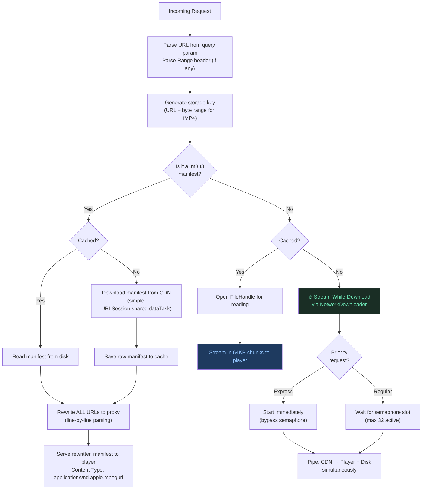

### Thread Safety

Every piece of shared mutable state is protected:

| Shared State                           | Protection | Why                                                                                   |
| -------------------------------------- | ---------- | ------------------------------------------------------------------------------------- |
| `_isRunning` (server state)            | `NSLock`   | Multiple threads may check/set server state                                           |
| `activeHandlers` (connection registry) | `NSLock`   | New connections and closures happen on different threads                              |
| `onComplete` handler (NetworkTask)     | `NSLock`   | `finish()` must be idempotent -- called from semaphore signal and URLSession delegate |
| `tasks` dictionary (SessionRouter)     | `NSLock`   | URLSession delegates fire on arbitrary threads                                        |

The `finish()` method on `NetworkTask` is designed to be idempotent -- calling it multiple times only executes the completion handler once:

```swift
func finish() {
    lock.lock()
    let handler = onComplete
    onComplete = nil  // Nil it out BEFORE calling
    lock.unlock()
    handler?()  // Execute outside the lock (prevents deadlock)
}
```

This prevents semaphore signal drift: if `finish()` were called twice and signaled the semaphore both times, the concurrency limit would effectively increase, eventually breaking the protection.

---

## Real-World Challenges: Every Bug and Issue

### 1. Socket Error 61: Connection Refused

**When:** Testing vertical feed with 5+ videos prefetching.

**Root Cause:** Each HLS stream requests ~50 segments. With 5 videos: ~250 concurrent TCP connections. iOS has OS-level socket limits that are significantly lower.

**Symptoms:** All video playback in the feed stopped simultaneously. Fatal and unrecoverable without restarting the app.

**Fix:** The rewrite's semaphore (32 concurrent download cap) + priority lanes. Even under extreme prefetching load, the system stays within OS limits. Tested with 10+ videos prefetching -- zero errors.

### 2. Mobile Network Stalls (First Attempt)

**When:** First real-device testing on 4G/3G networks.

**Root Cause:** Download-then-serve model. Every segment had to fully download and save before the player could see the first byte.

**Symptoms:** Visible stuttering between segments. On 3G, worse than no caching at all.

**Fix:** Optimization's hybrid strategy (CDN-direct + background cache), then refined further by the rewrite's stream-while-download (zero latency, zero waste).

### 3. Battery Drain and Mobile Data Waste

**When:** Testing network interruptions (airplane mode toggle, entering elevators).

**Root Cause:** Background downloader kept firing requests during network outages. Hundreds of URLSession tasks queued, consumed battery, then burst-downloaded on reconnection.

**Symptoms:** Excessive battery drain. Unexpected mobile data consumption.

**Fix:** Optimization's `NWPathMonitor` + circuit breaker. Single failure trips the breaker, halts all downloads. Monitor detects recovery, breaker resets. The rewrite removed this (relying on URLSession timeouts and semaphore backpressure instead), which is under evaluation for reintroduction.

### 4. The App Launch Race Condition

**When:** Intermittent failures on very first screen after cold app launch.

**Root Cause:** React Native UI mounted and called `convertUrl()` before the native TCP server finished binding to the port (~10-50ms startup time).

**Symptoms:** Videos occasionally failed to load on the first screen. Inconsistent -- sometimes worked, sometimes didn't.

**Fix:** Built a safety fallback into `convertUrl()` -- if the server isn't running, return the original remote URL. The video plays uncached rather than failing. The example app pattern `await startServer()` + loading indicator ensures the server is ready before the feed renders.

### 5. The MP4 Trap

**When:** Early prototyping when I tried routing all video formats through the proxy.

**Root Cause:** The proxy's model (even stream-while-download) is optimized for HLS where segments are small (2-6MB). A 500MB MP4 is a single monolithic file.

**Symptoms:** Multi-minute loading screens for large files. The proxy added overhead without benefit.

**Fix:** Documented as HLS-only. For MP4s, developers should use `expo-video`'s native `useCaching` prop, which handles large files with progressive loading.

### 6. Disk Bloat from Unwatched Content

**When:** Vertical feed testing. Users scrolled past videos in 2 seconds.

**Root Cause:** Optimization's background cacher downloaded _entire_ streams for every video, even ones the user barely glanced at.

**Symptoms:** Cache filled rapidly with unwatched content. LRU pruning evicted frequently-watched videos to make room for content that would never be replayed.

**Fix:** Partially addressed by the rewrite (only segments the player actually requests are cached -- no speculative prefetching). A planned **Head-Only Smart Caching** feature will further reduce this by only caching the first N segments.

### 7. LRU Read-Touch Trade-off

**When:** During the optimization refactor.

**Context:** In the first attempt, every cache read updated the file's `modificationDate` to "now" -- a "touch" that tracked when a file was last accessed. This was correct LRU behavior but added a filesystem write operation on every single cache hit.

**Decision:** I removed the read-touch to improve cache serving speed. Every segment request was hitting the cache, and the extra `setAttributes` call on every read added I/O overhead in a hot path. Removing it made cached segment serving faster.

**Side Effect:** Without the read-touch, LRU pruning evicts by write-time instead of last-access-time. A video cached 30 days ago but rewatched daily could be pruned before a video cached yesterday but never replayed. This only matters when the cache is full and pruning kicks in.

**Status:** Known trade-off. Evaluating a lighter-weight approach to restore last-access tracking without the per-read I/O cost.

### 8. DRM Content Incompatibility

**When:** Conceptual limitation identified during design.

**Root Cause:** Manifest rewriting changes URLs inside `.m3u8` files. DRM systems (Apple's FairPlay) use digital signatures to verify the manifest hasn't been tampered with.

**Impact:** Rewriting breaks the signature. DRM content cannot play through the proxy.

**Resolution:** Documented limitation. The library is designed for non-DRM (clear) HLS content.

---

## Real-World Performance

I tested the library on real devices and real networks:

### Video Load Time: First Frame Visible

**On Slow Mobile Data (~7 Mbps)**

| Scenario                                                       | Load Time |
| -------------------------------------------------------------- | --------- |
| With expo-video-cache, **no previous cache** (first ever play) | ~2300ms   |
| Without expo-video-cache (direct CDN streaming)                | ~1600ms   |
| With expo-video-cache, **content already cached**              | ~1600ms   |

On a first-ever play over slow mobile data, the proxy adds ~700ms of overhead while it fetches and processes the manifest. But once cached, subsequent plays match direct streaming speed -- and work completely offline.

**On Wi-Fi / Fast Mobile Data**

| Scenario                 | Load Time                |
| ------------------------ | ------------------------ |
| With expo-video-cache    | No noticeable difference |
| Without expo-video-cache | No noticeable difference |

On fast connections, the proxy overhead is invisible. The value shows up on second play and in offline scenarios.

### Binary Size Impact

| Version                | iOS Size Impact     | Cause                                        |
| ---------------------- | ------------------- | -------------------------------------------- |
| First Attempt          | ~2.5MB added        | Swifter HTTP server library                  |
| Optimization           | ~2.5MB added        | Swifter (unchanged)                          |
| **Rewrite**            | **~0** (negligible) | Zero third-party deps, only Apple frameworks |
| Android (all versions) | ~0                  | Pure passthrough shim                        |

### Evolution Summary

| Metric                         | First Attempt             | Optimization                    | Rewrite                                  |
| ------------------------------ | ------------------------- | ------------------------------- | ---------------------------------------- |
| **Data flow**                  | Download → save → serve   | CDN-direct + background cache   | Stream to player AND disk simultaneously |
| **First-play feel**            | Stuttering on mobile data | Smooth (but 2x bandwidth)       | Smooth (single download, zero waste)     |
| **Binary size**                | ~2.5MB                    | ~2.5MB                          | ~0                                       |
| **Third-party deps**           | Swifter                   | Swifter                         | None                                     |
| **Feed scrolling (5+ videos)** | Works                     | Socket Error 61                 | Stable                                   |
| **File descriptor exhaustion** | Possible                  | Possible                        | Eliminated (lazy allocation)             |
| **fMP4 cache correctness**     | Collisions possible       | Collisions possible             | Correct (range-aware keys)               |
| **Network resilience**         | None                      | NWPathMonitor + circuit breaker | URLSession timeouts + backpressure       |
| **iOS Swift files**            | 3                         | 3                               | 6                                        |
| **Thread safety**              | Swifter internal          | Minimal                         | NSLock on all shared state               |

---

## Using It In Your App

### Installation

```bash
yarn add expo-video-cache
# or
npx expo install expo-video-cache
```

### Server Startup

```typescript
import { useEffect, useState } from "react";
import { View, ActivityIndicator } from "react-native";
import * as VideoCache from "expo-video-cache";

export default function App() {
  const [isReady, setIsReady] = useState(false);

  useEffect(() => {
    const init = async () => {
      try {
        await VideoCache.startServer(9000, 1024 * 1024 * 1024); // Port 9000, 1GB limit
        setIsReady(true);
      } catch (e) {
        console.error("Server failed to start", e);
        setIsReady(true); // Graceful degradation
      }
    };
    init();
  }, []);

  if (!isReady) {
    return (
      <View style={{ flex: 1, justifyContent: "center", alignItems: "center" }}>
        <ActivityIndicator size="large" />
      </View>
    );
  }

  return <Stream />;
}
```

### The Platform-Aware Source Helper

This single function encapsulates all platform logic. On iOS, it routes through the proxy. On Android, it uses ExoPlayer's built-in caching. No `if/else` in your components:

```typescript
import { Platform } from "react-native";
import * as VideoCache from "expo-video-cache";

export const getVideoSource = (url: string) => ({
  uri: Platform.OS === "android" ? url : VideoCache.convertUrl(url),
  useCaching: Platform.OS === "android",
});
```

**Why `useCaching: false` on iOS?** The proxy is already caching every segment. Enabling native caching would make AVPlayer try to cache the localhost response -- redundant duplication with potential conflicts between two independent cache layers.

### Vertical Feed Integration

```typescript
import { useMemo } from "react";
import { FlatList, Dimensions } from "react-native";

const rawVideoData = [
  { uri: "https://cdn.example.com/feed/video1.m3u8" },
  { uri: "https://cdn.example.com/feed/video2.m3u8" },
  { uri: "https://cdn.example.com/feed/video3.m3u8" },
];

export default function Stream() {
  const videoSources = useMemo(
    () => rawVideoData.map((item) => getVideoSource(item.uri)),
    []
  );

  return (
    <FlatList
      data={videoSources}
      renderItem={({ item, index }) => (
        <VideoItem source={item} isActive={index === currentIndex} />
      )}
      pagingEnabled
      windowSize={3}         // Keep 3 screens worth of items (tight for memory)
      initialNumToRender={1} // Render only first item initially
      maxToRenderPerBatch={2} // Render at most 2 items per frame
    />
  );
}
```

```typescript
import { useEffect, useRef } from "react";
import { Pressable } from "react-native";
import { useVideoPlayer, VideoView } from "expo-video";

export default function VideoItem({ source, isActive, height }) {
  const player = useVideoPlayer(source, (player) => {
    player.loop = true;
    player.muted = true;
  });

  // useRef instead of useState for network state -- no re-renders on change
  const wasOfflineRef = useRef(false);
  const isActiveRef = useRef(isActive);
  isActiveRef.current = isActive;

  useEffect(() => {
    if (isActive) player.play();
    else player.pause();
  }, [isActive]);

  return (
    <Pressable style={{ height, width: "100%" }}>
      <VideoView style={{ flex: 1 }} player={player} nativeControls={false} />
    </Pressable>
  );
}
```

### Platform Compatibility

| Platform    | Cache Engine       | What Happens                                                                                     |
| ----------- | ------------------ | ------------------------------------------------------------------------------------------------ |
| **iOS**     | expo-video-cache   | Local TCP proxy intercepts all HLS traffic. Manifests are rewritten. Segments are stream-cached. |
| **Android** | Native (ExoPlayer) | URL passed through unchanged. ExoPlayer's built-in LRU caching handles everything natively.      |
| **Web**     | Browser Cache      | Returns original URL. Standard HTTP cache headers apply.                                         |

---

## Key Technical Decisions

### 1. Server Technology Evolution

| Phase         | Choice                                     | Reasoning                                                | Trade-off                                     |
| ------------- | ------------------------------------------ | -------------------------------------------------------- | --------------------------------------------- |
| First Attempt | **Swifter** (Swift HTTP server)            | Modern, lightweight, fast to integrate                   | ~2.5MB binary size, no connection control     |
| Optimization  | **Swifter** (unchanged)                    | Not a priority yet                                       | Same trade-offs                               |
| Rewrite       | **NWListener/NWConnection** (Apple native) | Zero deps, full control over connections and concurrency | More code (6 files vs 3), manual HTTP parsing |

### 2. Data Flow Evolution

| Phase         | Model                                    | Why                            | Problem Created                                      |
| ------------- | ---------------------------------------- | ------------------------------ | ---------------------------------------------------- |
| First Attempt | Download → Save → Serve                  | Simple, correct                | Blocks playback on slow networks                     |
| Optimization  | CDN-direct + background cache            | Eliminates playback blocking   | 2x bandwidth, disk bloat, socket exhaustion in feeds |
| Rewrite       | Stream to player AND disk simultaneously | Best of both: fast + efficient | None (but more complex to implement)                 |

### 3. Fixed Port Design

`convertUrl()` is synchronous -- it cannot `await` the server to report which port it bound to. The port must be known upfront. I chose a fixed default (9000) with explicit failure if the port is taken, rather than auto-incrementing. This eliminates race conditions where URLs are generated with one port but the server binds to another.

### 4. `Connection: close` on All Responses

Each HTTP request gets its own TCP connection -- no keep-alive. This simplifies lifecycle management (no connection pooling, no state tracking between requests). For a localhost proxy, the TCP overhead is negligible.

### 5. Manifest Rewriting Strategy

The optimization's conditional rewriting (cached=proxy, uncached=CDN) was the right choice _for that architecture_ -- the proxy added latency on cache misses, so bypassing it was beneficial. The rewrite reverted to always-proxy because stream-while-downloading eliminated the latency penalty. Routing everything through the proxy ensures complete caching on first play.

---

## Future Roadmap

### Head-Only Smart Caching

The feature I'm most excited to build. In a vertical feed, most users swipe past a video within a few seconds. Right now, the proxy caches every segment the player requests. But what if I only cached the **first N segments** -- say, the first 10-15 seconds?

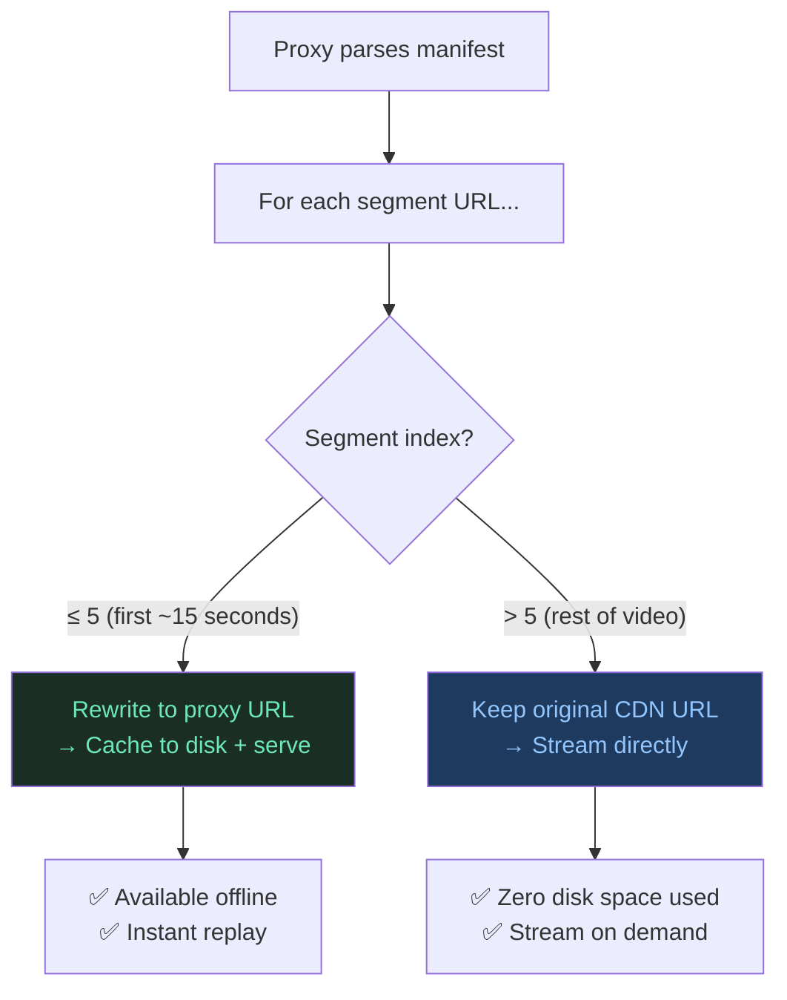

The opening always plays instantly from cache. Users who watch the full video stream the rest seamlessly from the CDN. Users who swipe away don't waste storage on content they'll never replay. This could dramatically reduce disk usage without sacrificing the instant-play experience.

---

_expo-video-cache is open-source and available on [npm](https://www.npmjs.com/package/expo-video-cache) and [GitHub](https://github.com/Monisankarnath/expo-video-cache)._
