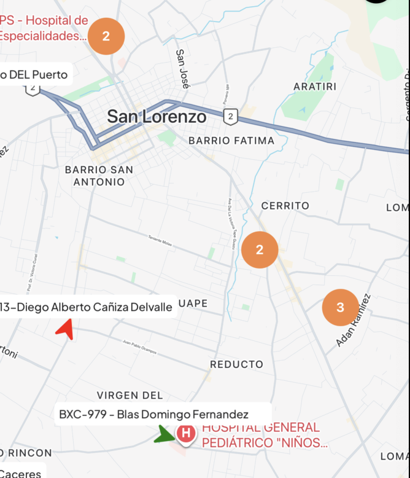
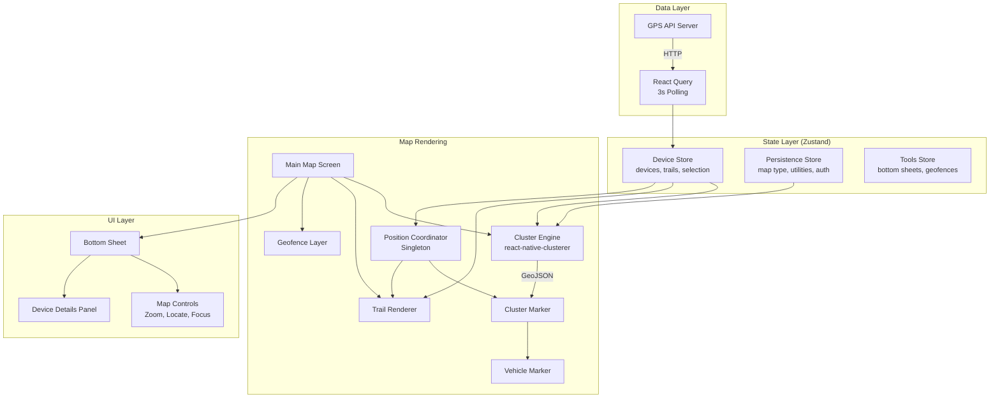
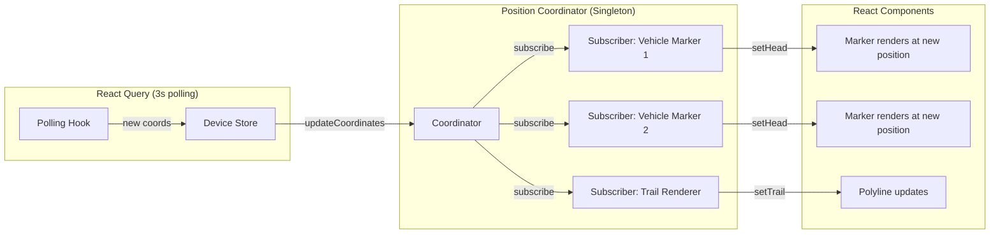
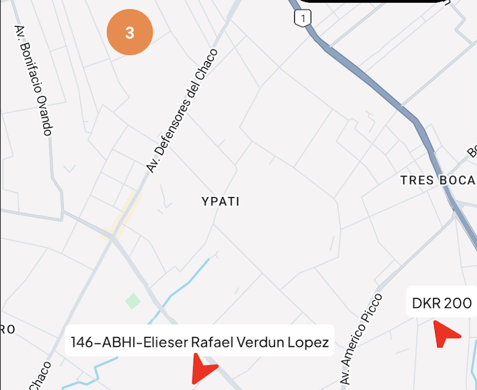
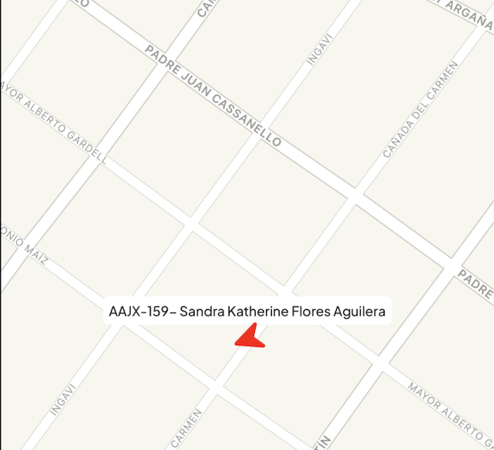
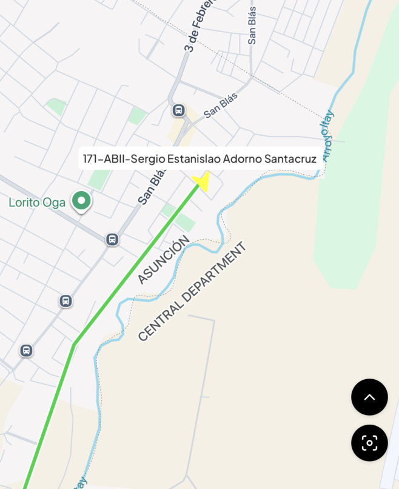

> 


## 1. Executive Summary

This case study documents the engineering journey behind the map interface of a production GPS fleet tracking application serving **50,000+ users**. The core challenge was deceptively simple: render hundreds of live vehicle markers on a map in real-time, across both iOS and Android, without crashing, lagging, or draining the user's battery.

What began as a straightforward "put dots on a map" feature evolved into a multi-month deep dive into native rendering pipelines, cross-platform inconsistencies, React Native's new architecture, and the subtle art of making a 3-second polling loop feel like a live video feed.

**Key results:**

- **1000+ devices** rendered simultaneously in production at **60 FPS**
- **Crash rate reduced to 0** on the map interface (from multiple crashes per session)
- Custom marker rendering bugs resolved across **both platforms** with different solutions for each
- A complete history playback system with animated route scrubbing, speed graphs, and event timelines

---

## 2. Project Overview & Tech Stack

The application is a GPS fleet management platform built with **React Native (0.79)** and **Expo (SDK 53)**. The map is the centerpiece of the product—it's where fleet managers spend 90% of their time monitoring vehicles, reviewing routes, and managing geofences.

### Core Dependencies

| Category         | Library                      | Version | Purpose                   |
| ---------------- | ---------------------------- | ------- | ------------------------- |
| **Map**          | `react-native-maps`          | 1.20.1  | Google Maps rendering     |
| **Clustering**   | `react-native-clusterer`     | 3.0.0   | C++ Supercluster port     |
| **Animation**    | `react-native-reanimated`    | 3.17.5  | Worklet-based animations  |
| **State**        | `zustand`                    | 5.0.6   | Lightweight global state  |
| **Server State** | `@tanstack/react-query`      | 5.81.5  | Polling, caching, sync    |
| **Bottom Sheet** | `@gorhom/bottom-sheet`       | 5.1.6   | Interactive bottom panels |
| **Charts**       | `react-native-gifted-charts` | 1.4.61  | Speed visualization       |
| **SVG**          | `react-native-svg`           | 15.11.2 | Custom marker icons       |
| **Navigation**   | `expo-router`                | 5.0.7   | File-based routing        |

### Architecture Overview



---

## 3. Architecture Decision Record: Why Google Maps + a C++ Clusterer

Before writing any map code, I had to make two foundational decisions that would shape the entire feature.

### 3.1 Google Maps vs. Mapbox

The choice between Google Maps (via `react-native-maps`) and Mapbox (via `@rnmapbox/maps`) was not purely technical—it was a product decision.

| Factor                   | Google Maps                         | Mapbox                             |
| ------------------------ | ----------------------------------- | ---------------------------------- |
| **API Cost**             | Lower for our volume                | Significantly higher               |
| **User Familiarity**     | Universal (Google Maps style)       | Less familiar to most users        |
| **Street Naming**        | Localized, accurate (Latin America) | Less detailed in our region        |
| **React Native Support** | Mature, large community             | Smaller community, newer           |
| **Clustering**           | Needs external library              | Built-in (but JS-based)            |
| **Custom Markers**       | Native views (powerful but buggy)   | SDF icons (limited but performant) |

**Decision:** Google Maps via `react-native-maps`. The cost difference was significant at our scale, and our users (primarily in Latin America) were deeply accustomed to Google Maps' visual language. Street names, landmark recognition, and satellite imagery quality were all superior for our region.

> I did build a full Mapbox prototype to validate the alternative. While Mapbox's built-in `ShapeSource` clustering was elegant, it locked us into SDF (Signed Distance Field) icons for dynamic coloring—which meant losing our rich custom marker UI. I shelved this as a future option if Google Maps' bugs became unmanageable.

### 3.2 Choosing react-native-clusterer Over Alternatives

With Google Maps chosen, I needed a clustering solution. The options were:

| Library                       | Engine                  | Speed       | Notes                                |
| ----------------------------- | ----------------------- | ----------- | ------------------------------------ |
| `react-native-map-clustering` | JavaScript Supercluster | Slow        | Popular but JS-thread bound          |
| `react-native-clusterer`      | **C++ (JSI)**           | **Fastest** | Direct port of Mapbox's Supercluster |
| Custom implementation         | JavaScript              | Variable    | Full control, high maintenance       |

**Decision:** `react-native-clusterer` (v3.0.0). It's a C++ JSI binding of Mapbox's battle-tested Supercluster algorithm. Cluster computation happens on the native thread via JSI, not on the JavaScript thread. This was critical—with 1000+ devices, even a 50ms JS-thread block during cluster computation would cause visible frame drops.

---

## 4. The Clustering Engine: From 1000 Components to ~10

The single biggest performance win in the entire project. Without clustering, 1000 devices meant 1000 `<Marker>` components in the React tree, each managing native views, gesture handlers, and coordinate tracking. With clustering, that number dropped to roughly 1-15 visible markers at any zoom level.

### 4.1 The GeoJSON Data Pipeline

Every data point that enters the clustering engine must be in GeoJSON format. I built a strict conversion pipeline with validation:

```typescript
export const convertDeviceDataToGeoJSON = (
  devices: GpsWoxDevice[],
): GeoJsonData[] => {
  if (!Array.isArray(devices)) return [];

  return devices
    .map((device) => {
      // Strict validation: reject malformed data before it reaches the clusterer
      if (
        !device ||
        device.id == null ||
        typeof device.id !== 'number' ||
        typeof device.name !== 'string' ||
        !Number.isFinite(device.lng) ||
        !Number.isFinite(device.lat)
      ) {
        return null;
      }

      return {
        type: 'Feature' as const,
        geometry: {
          type: 'Point' as const,
          coordinates: [device.lng, device.lat],
        },
        properties: {
          id: device.id,
          device: device, // Full device object for marker rendering
          poi: null,
          isPoi: false,
        },
        id: device.id,
      };
    })
    .filter((item) => item !== null) as GeoJsonData[];
};
```

**Why strict validation matters:** A single `NaN` coordinate reaching the C++ Supercluster engine would cause a native crash with no useful stack trace. The validation layer was added after debugging several of these silent crashes in production.

### 4.2 Unified POI + Device Clustering

Early in development, I had two separate clustering instances—one for vehicles, one for Points of Interest (POIs). This caused severe issues:

1. **Visual overlap:** Vehicle clusters and POI clusters would render on top of each other at the same coordinates, creating an unreadable mess.
2. **Performance:** Two clusterer instances meant double the computation on every region change.
3. **Interaction conflicts:** Tapping a cluster would sometimes hit the POI cluster behind the vehicle cluster, or vice versa.

**The solution:** Merge both data sources into a single GeoJSON array and feed them through one `<Clusterer>` instance:

```typescript
const geoJsonData: GeoJsonData[] = React.useMemo(() => {
  const visibleDevices =
    selectedDevices?.length <= 0
      ? mapDevices
      : mapDevices.filter((device) => selectedDevices.includes(device.id));

  const deviceData = convertDeviceDataToGeoJSON(visibleDevices ?? []);

  if (!isPoiActive) return deviceData;

  // Merge POI and device data into a single array
  const poiData = convertPOIDataToGeoJSON(poiItems?.items?.mapIcons ?? []);
  return [...deviceData, ...poiData];
}, [mapDevices, poiItems, isPoiActive, selectedDevices]);
```

The cluster marker component then inspects `feature.properties` to determine what to render—is this a cluster bubble, a POI, or a vehicle?

```typescript
{isPointCluster(feature) ? (
  // Cluster bubble showing device count
  <View style={{ backgroundColor: colors.Orange500, borderRadius: 20, ... }}>
    <Text>{feature.properties.point_count}</Text>
  </View>
) : feature.properties.poi ? (
  // Point of Interest icon loaded from remote URL
  <POIIcon poi={feature.properties.poi} />
) : isDevice ? (
  // Vehicle marker: name label + directional arrow
  <VehicleMarker device={feature.properties.device} />
) : null}
```

This unified approach eliminated all overlap issues and halved clustering computation time.

### 4.3 Adaptive Cluster Radius

A fixed cluster radius doesn't work well across different fleet sizes. 15 vehicles in a city need tight clusters; 500 vehicles across a country need aggressive grouping.

```typescript
const clusterOptions = React.useMemo(() => {
  const getRadius = (deviceCount: number) => {
    if (deviceCount <= 15) return 20; // Tight: individual vehicles visible early
    if (deviceCount <= 30) return 30; // Medium: balanced grouping
    return 60; // Aggressive: prevent visual noise
  };

  return {
    radius: getRadius(deviceCount),
    maxZoom: 12, // Stop clustering beyond zoom level 12
  };
}, [deviceCount]);
```

These values were tuned through extensive testing with real production data (fleets ranging from 5 to 1000+ vehicles).

### 4.4 Memoization Strategy: Custom Equality Comparators

The default `React.memo` shallow comparison is insufficient for map markers. A device object has dozens of fields, but only a handful affect the visual output. I wrote custom comparators at every level:

**Cluster level** — Only re-render if the region actually changed:

```typescript
function areRegionsEqual(
  prevProps: { mapRegion: Region },
  nextProps: { mapRegion: Region },
) {
  return (
    prevRegion.latitude === nextRegion.latitude &&
    prevRegion.longitude === nextRegion.longitude &&
    prevRegion.latitudeDelta === nextRegion.latitudeDelta &&
    prevRegion.longitudeDelta === nextRegion.longitudeDelta
  );
}

export const ClusterEngine = React.memo(
  ClusterEngineComponent,
  areRegionsEqual,
);
```

**Marker level** — Only re-render if visually-relevant device properties changed:

```typescript
const areFeaturesEqual = (prev: IFeature, next: IFeature) => {
  if (p.device && n.device) {
    const prevDevice = p.device as GpsWoxDevice;
    const nextDevice = n.device as GpsWoxDevice;

    return (
      prevDevice.id === nextDevice.id &&
      prevDevice.lat === nextDevice.lat && // Position
      prevDevice.lng === nextDevice.lng &&
      prevDevice.course === nextDevice.course && // Direction
      prevDevice.speed === nextDevice.speed && // Speed (affects color)
      prevDevice.online === nextDevice.online && // Online status (affects color)
      getCarColor(prevDevice) === getCarColor(nextDevice) // Derived color
    );
  }
  // ... cluster and POI comparisons
};
```

**Device marker level** — Prevent re-renders from irrelevant prop changes:

```typescript
(prevProps, nextProps) => {
  return (
    prevProps.device.id === nextProps.device.id &&
    prevProps.device.lat === nextProps.device.lat &&
    prevProps.device.lng === nextProps.device.lng &&
    prevProps.device.course === nextProps.device.course &&
    prevProps.device.speed === nextProps.device.speed &&
    prevProps.device.online === nextProps.device.online
  );
};
```

This three-tier memoization strategy meant that when one device out of 1000 moved, only **that device's marker** would re-render—not the cluster, not other markers, nothing else.

---

## 5. Custom Marker Rendering: A Cross-Platform Nightmare

This section documents the most time-consuming debugging effort in the project. What should have been a simple "show an arrow icon on the map" turned into weeks of platform-specific bug hunting.

### 5.1 The Problem: Our Marker is Not a Pin

Unlike a default map pin, our vehicle marker is a **composite React Native view**:

```
┌─────────────────────┐
│    Device Name       │  ← Name label (text)
│ "Joe'sToyota Hilux"  │
├─────────────────────┤
│       ▲              │  ← Arrow SVG (rotated by vehicle heading°)
│      ╱ ╲             │     Color = f(speed, online, blocked)
│     ╱   ╲            │
└─────────────────────┘
```

This composite marker is:

- **26px tall** for the car icon + **26px** for the name plate = **52px total**
- **Rotated** based on `device.course` (vehicle heading in degrees)
- **Color-coded** based on device status (green=moving, yellow=idling, red=offline, black=blocked)

```typescript
return (
  <View style={{ alignItems: 'center' }}>
    {/* Name label above the arrow */}
    <NameLabel deviceName={device?.name ?? ''} />
    {/* Directional arrow, rotated to match vehicle heading */}
    <View style={{ width: 26, height: 26, transform: [{ rotate: `${device.course || 0}deg` }] }}>
      <Icons.CarArrow color={carColor} width={22} height={22} />
    </View>
  </View>
);
```

The color is derived from a status decision tree that parses device telemetry data, including XML-encoded fields:

```typescript
export function getDeviceStatus(device: GpsWoxDevice): DeviceStatus {
  const isDeviceOffline = device?.online.toLowerCase() === 'offline';
  const speed = Number(device?.speed ?? 0);

  // Ignition status from Traccar engine timestamps
  const engineOnAt = traccarData?.engine_on_at ? new Date(...).getTime() : 0;
  const engineOffAt = traccarData?.engine_off_at ? new Date(...).getTime() : 0;
  const ignitionOn = engineOnAt > engineOffAt;

  // Blocked status from XML data
  const xml = device?.device_data?.traccar?.other ?? '';
  const blocked = tag('blocked') === 'true';

  // Priority-based decision tree
  if (isDeviceOffline) return 'offline';     // → Red
  if (blocked)         return 'blocked';     // → Black
  if (speed > 0)       return 'moving';      // → Green
  if (ignitionOn)      return 'engine';      // → Yellow (idling)
  return 'stopped';                          // → Yellow
}
```

This level of marker complexity triggers several platform-specific bugs in `react-native-maps`.

### 5.2 Android: The Bitmap Cutoff Bug

**The bug:** On Android, `react-native-maps` converts custom marker views into bitmaps for the Google Maps SDK. But it calculates the bitmap size **before** the React Native view has fully laid out. If the custom view exceeds the pre-calculated size (which our name plate + arrow did), the marker gets **clipped**—the bottom half of the arrow would be cut off.

**The root cause:** This is a known issue in `react-native-maps` ([GitHub Issue #3848](https://github.com/react-native-maps/react-native-maps/issues/3848)). The native Android code calls `measure()` on the custom view, but the measurement doesn't account for children that haven't completed their layout pass.

**The fix:** I used `patch-package` to patch `react-native-maps` directly, increasing the bitmap allocation size for custom markers. This was a surgical fix:

```json
{
  "scripts": {
    "postinstall": "patch-package"
  }
}
```

The patch modified the native Android marker rendering code to allocate a larger bitmap canvas, preventing the cutoff. This is the kind of fix that doesn't exist in any documentation—I found it by reading the native Java source code of the library.

### 5.3 iOS: The `tracksViewChanges` Lifecycle

**The bug:** On iOS, custom markers would randomly become **invisible** after zooming or panning. No crash, no error—the marker would simply disappear. Console logs confirmed the component was still mounted and receiving props. The native view was just... gone.

**The investigation:** Through extensive logging, I confirmed that:

1. The marker component was **not unmounting**
2. The marker was receiving correct coordinates
3. The issue was in the **native snapshot** of the custom view

**The root cause:** `react-native-maps` on iOS converts custom marker views to a static image (snapshot) for performance. The `tracksViewChanges` prop controls whether this snapshot is refreshed. When set to `true`, every frame triggers a new snapshot (expensive). When set to `false`, the snapshot is cached (performant but stale).

The bug was a race condition: when the map region changed rapidly (zoom/pan), iOS would sometimes cache a **zero-size snapshot** of the marker during a layout transition, and then never refresh it.

**The solution:** A carefully tuned `tracksViewChanges` lifecycle:

```typescript
const SNAPSHOT_DISABLE_DELAY = 400; // Tuned through cross-platform testing

const [tracksViewChanges, setTracksViewChanges] = useState(true);
const snapshotTimeoutRef = useRef<number | null>(null);

useEffect(() => {
  // Step 1: Enable snapshot tracking when marker data changes
  setTracksViewChanges(true);

  // Step 2: Clear any pending timeout
  if (snapshotTimeoutRef.current) {
    clearTimeout(snapshotTimeoutRef.current);
    snapshotTimeoutRef.current = null;
  }

  // Step 3: After 400ms, disable tracking (cache the snapshot)
  snapshotTimeoutRef.current = setTimeout(() => {
    setTracksViewChanges(false);
    snapshotTimeoutRef.current = null;
  }, SNAPSHOT_DISABLE_DELAY) as unknown as number;

  return () => {
    if (snapshotTimeoutRef.current) {
      clearTimeout(snapshotTimeoutRef.current);
    }
  };
}, [appearanceKey]); // Triggers on any visual change
```

**Why 400ms?** This was determined through extensive testing on both platforms. 200ms was too short—some markers hadn't completed their layout pass. 600ms worked but caused noticeable performance degradation with many markers. 400ms was the sweet spot where all markers had time to render their snapshot correctly before caching.

**Platform-specific application:**

```typescript
tracksViewChanges={
  Platform.OS === 'android'
    ? tracksViewChanges              // Android: full lifecycle
    : isPoi
      ? !isPoiImageLoaded            // iOS POIs: until image loads
      : false                        // iOS devices: never (handled differently)
}
```

### 5.4 Marker Positioning: `anchor` vs. `centerOffset`

Another cross-platform inconsistency. Our marker's visual center is not the geometric center of the view—it's at the car arrow icon, which sits below the name plate.

```
      "Toyota Hilux"     ← Name plate (26px)
           ▲              ← Arrow (26px) — THIS is where the GPS coordinate should point
```

**Android** uses `anchor` (normalized 0-1 coordinates):

```typescript
anchor={isDevice ? { x: 0.5, y: anchorY } : undefined}
// anchorY = (totalHeight - CAR_ICON_HEIGHT / 2) / totalHeight
```

**iOS** uses `centerOffset` (pixel offset from center):

```typescript
centerOffset={
  Platform.OS === 'ios' && isDevice
    ? { x: 0, y: centerOffsetY }  // centerOffsetY = -(CAR_ICON_HEIGHT / 2)
    : undefined
}
```

Using `anchor` on iOS caused the marker to be positioned incorrectly after zoom changes. Using `centerOffset` on Android had no effect. Each platform respected only its own positioning prop—a detail not documented in the library.

### 5.5 From Animated Markers to Lightweight Markers

My first marker implementation was ambitious—each vehicle marker had its own `react-native-reanimated` animation system:

```typescript
// Each marker independently animated its position
animatedLat.value = withTiming(device.lat, {
  duration: 2000,
  easing: Easing.out(Easing.ease),
});
animatedLng.value = withTiming(device.lng, {
  duration: 2000,
  easing: Easing.out(Easing.ease),
});

// And its heading rotation with shortest-path logic
let diff = targetCourse - currentCourse;
if (diff > 180) diff -= 360;
else if (diff < -180) diff += 360;
animatedCourse.value = withTiming(currentCourse + diff, { duration: 300 });
```

This worked beautifully with 5-10 devices. With 100+, it caused:

1. **Memory pressure:** Each marker held 3 shared values + 2 animated reactions + 1 animated style
2. **Crashes:** Combined with clustering, animated markers inside clusters would try to animate to coordinates that the cluster had already consumed
3. **Visual glitches:** Markers would briefly appear at old coordinates before animating to new ones during cluster break/merge

**The solution:** I rebuilt the vehicle marker as a lightweight, stateless component that relies on a centralized position coordinator for position updates and uses a simple `transform` for rotation:

```typescript
<View style={{ transform: [{ rotate: `${device.course || 0}deg` }] }}>
  <Icons.CarArrow color={carColor} width={22} height={22} />
</View>
```

No `useSharedValue`, no `withTiming`, no `useAnimatedStyle`. The marker just renders whatever data it receives. Position coordination is handled at a higher level by a centralized singleton (covered in Section 7).

---

## 6. React Native New Architecture: Platform-Specific Chaos

React Native's New Architecture (Fabric renderer + TurboModules) promises better performance, but introduced a set of platform-specific bugs that required a creative per-platform configuration.

### 6.1 iOS + New Arch: The Vanishing Marker Bug

**The bug:** With `newArchEnabled: true` on iOS, custom map markers would **disappear inconsistently** when zooming in or panning. This was distinct from the `tracksViewChanges` issue—even with `tracksViewChanges={true}` permanently, markers would vanish.

**The root cause:** The Fabric renderer on iOS handles native view recycling differently than the old Paper renderer. `react-native-maps`' custom marker implementation relies on specific lifecycle methods that Fabric doesn't invoke in the same order. The marker's native view would be recycled by Fabric during a map gesture, and the library couldn't recover it.

### 6.2 Android - New Arch = Broken ScrollViews & Animations

**The bug:** Disabling New Architecture on Android caused a cascade of unrelated issues:

- `ScrollView` and `FlatList` gestures became erratic
- `react-native-reanimated` animations would stutter
- Bottom sheet interactions broke (gesture conflicts)
- List scrolling in `@gorhom/bottom-sheet` became unreliable

### 6.3 The Split Configuration Solution

The only viable path was a **per-platform New Architecture configuration**:

```json
{
  "expo": {
    "plugins": [
      [
        "expo-build-properties",
        {
          "ios": {
            "newArchEnabled": false // Disabled: fixes marker bugs
          },
          "android": {
            "newArchEnabled": true // Enabled: fixes scroll/animation bugs
          }
        }
      ]
    ]
  }
}
```

### 6.4 iOS Bottom Sheet Clipping: removeClippedSubviews

Disabling New Architecture on iOS introduced a secondary bug: items in the `BottomSheetSectionList` (inside `@gorhom/bottom-sheet`) that scrolled off-screen would **never reappear** when scrolled back.

**The root cause:** `removeClippedSubviews` (a React Native optimization that unmounts off-screen views) behaves differently under the old Paper renderer. Clipped views were not being re-mounted when scrolled back into the viewport.

**The fix:** Dynamically toggle `removeClippedSubviews` based on whether the bottom sheet is fully expanded:

```typescript
<BottomSheetSectionList
  removeClippedSubviews={Platform.OS === 'ios' ? !listIsFocused : true}
  // ...
/>
```

When the list is fully visible (`listIsFocused = true`), clipping is disabled so all items render. When collapsed, clipping is re-enabled for performance.

---

## 7. Real-Time Movement: The Position Coordinator

One of the most architecturally interesting pieces of the system. The position coordinator is a **singleton module that lives outside of React's component tree**, coordinating marker positions and trail rendering for all devices simultaneously.

### 7.1 Version 1: Animated Interpolation (and Why It Failed)

My first implementation used `Animated.timing` to smoothly interpolate each device's position from its previous coordinates to the new ones:

```typescript
// Interpolated marker position between points A and B
Animated.timing(a.anim, {
  toValue: 1,
  duration: MARKER_ANIMATION_DURATION, // 1000ms
  useNativeDriver: false, // Can't use native driver for coordinate values
}).start(() => {
  a.currentHead = end;
  a.staticTrail = coords.slice();
});

// Listener updated head position every frame
const listenerId = a.anim.addListener(({ value }) => {
  const t = Math.max(0, Math.min(1, value));
  const lat = start.latitude + (end.latitude - start.latitude) * t;
  const lng = start.longitude + (end.longitude - start.longitude) * t;
  const point = { latitude: lat, longitude: lng };
  a.currentHead = point;
  a.listeners.forEach((l) => l(point));
});
```

**Why it failed:** The trail polyline was being drawn from the device's historical coordinates, which included the **final destination** of the animation (point B). But the marker was still **animating toward** point B. This meant:

```
Trail polyline: A ───────────────────── B  (draws instantly to B)
Marker:         A ─ ─ ─ ─ ─ →              (animating slowly toward B)
```

The trail would visibly outrun the marker, creating a jarring disconnect where the polyline extended past the vehicle icon. With 3-second polling intervals, this happened every single update cycle.

### 7.2 Version 2: The Direct-Update Singleton

The current implementation eliminates animation entirely in favor of direct coordinate updates:

```typescript
export function updateDeviceCoordinates(deviceId: number, coords: LatLng[]) {
  if (!coords || coords.length === 0) return;

  const a = createAnimatorIfNeeded(deviceId);
  const last = coords[coords.length - 1];

  // Directly update — no animation
  a.currentHead = last;
  a.staticTrail = coords.slice();
  a.coords = coords.slice();

  // Notify all listeners instantly
  a.listeners.forEach((l) => l(last));
}
```

**The architecture pattern:**



The hook that connects React components to the singleton:

```typescript
export function useAnimatedHead(deviceId: number, coords: LatLngSimple[]) {
  const [head, setHead] = useState<LatLngSimple | null>(() =>
    deviceId ? getCurrentHead(deviceId) : null,
  );
  const [trail, setTrail] = useState<LatLngSimple[]>(() =>
    deviceId ? getCurrentTrail(deviceId) : [],
  );

  // Subscribe to position updates
  useEffect(() => {
    if (!deviceId) return;
    const unsub = subscribeAnimatedHead(deviceId, (c) => setHead(c));
    return unsub;
  }, [deviceId]);

  // Push new coordinates when they arrive
  useEffect(() => {
    if (!deviceId || !coords?.length) return;
    updateDeviceCoordinates(deviceId, coords);
    setTrail(getCurrentTrail(deviceId));
  }, [
    deviceId,
    coords?.[coords.length - 1]?.latitude,
    coords?.[coords.length - 1]?.longitude,
  ]);

  return [head, trail] as const;
}
```

**Why a singleton?** Because both the vehicle markers and the trail polylines need to read the same device's position. If each component managed its own animation, they would go out of sync. The singleton ensures a single source of truth for every device's current head position.

**Auto-cleanup:** When all subscribers for a device disconnect (marker unmounts due to clustering), the animator is automatically deleted:

```typescript
function cleanupAnimatorIfUnused(deviceId: number) {
  const a = animators.get(deviceId);
  if (!a) return;
  if (a.listeners.size === 0) {
    a.anim.removeAllListeners();
    animators.delete(deviceId);
  }
}
```

### 7.3 Vehicle Trails: The Double-Polyline Technique

Vehicle trails use a double-polyline technique for visibility across all map styles:

```typescript
<>
  {/* White border polyline — provides contrast on dark map styles */}
  <AnimatedPolyline
    coordinates={polylineCoords}
    strokeColor={colors.white}
    strokeWidth={scale(7)}
    zIndex={0}
  />
  {/* Green trail polyline — the visible trail */}
  <AnimatedPolyline
    coordinates={polylineCoords}
    strokeColor={TRAIL_COLOR}  // '#00D138'
    strokeWidth={scale(4)}
    zIndex={1}
  />
</>
```

A single green line becomes nearly invisible on satellite or terrain map styles. The white border creates a consistent outline that works on any background. The `fillColor` prop is iOS-specific—without it, polylines on iOS render with transparent fill areas on sharp turns.

---

## 8. The Real-Time Data Pipeline

### 8.1 Polling Architecture: 3-Second Intervals with React Query

The real-time experience is powered by TanStack React Query's `refetchInterval`:

```typescript
useQuery({
  queryKey: ['latestDevices'],
  queryFn: () => getLatestDevices(payload),
  refetchInterval: 3000, // Poll every 3 seconds
  enabled: isFetchLatestDevicesOn && !!userApiHash && isOnline,
});
```

On every successful fetch, the hook:

1. Updates `latestDevices` in the store
2. Pushes new coordinates to `latestDeviceTrails` (capped at 20 points per device)
3. Updates `mapDevices` for visible devices only
4. Auto-updates the `selectedDevice` if its data changed
5. Deduplicates identical positions using an epsilon check (`1e-6`)

### 8.2 Smart Polling: Focus-Aware & App-State-Aware

Polling 24/7 would drain battery and waste data. I implemented a two-layer gating system:

**Layer 1: Screen focus** — Polling only runs when the map screen is active:

```typescript
useFocusEffect(
  React.useCallback(() => {
    if (allDeviceData && allDeviceData.length > 0) {
      setIsFetchLatestDevicesOn(true); // Start polling
    }
    return () => {
      setIsFetchLatestDevicesOn(false); // Stop when screen loses focus
    };
  }, [allDeviceData]),
);
```

**Layer 2: App state** — Polling pauses when the app goes to background:

```typescript
React.useEffect(() => {
  const subscription = AppState.addEventListener('change', (nextAppState) => {
    if (nextAppState.match(/inactive|background/)) {
      setIsFetchLatestDevicesOn(false); // Pause in background
    }
    if (nextAppState.match(/active|foreground/)) {
      setIsFetchLatestDevicesOn(true); // Resume when active
    }
  });
  return () => subscription.remove();
}, []);
```

### 8.3 State Management with Zustand

The app uses three Zustand stores with distinct responsibilities:

| Store             | Persistence      | Responsibility                            |
| ----------------- | ---------------- | ----------------------------------------- |
| `useDeviceStore`  | None (volatile)  | Device data, trails, selection, map state |
| `usePersistStore` | Expo SecureStore | Auth tokens, map preferences, language    |
| `useToolsStore`   | None (volatile)  | UI state for bottom sheets, tools         |

**Key pattern: Selector-based subscriptions.** Every component subscribes to the minimum slice of state it needs:

```typescript
// Only re-renders when mapDevices changes, not when selectedDevice or trails change
const mapDevices = useDeviceStore((s) => s.mapDevices);
```

This is critical for map performance. If the selected device changes, the cluster engine should not re-render—it reads from a different state selector.

---

## 9. History Playback & Route Analytics

Beyond real-time tracking, fleet managers need to review historical routes—where a vehicle went, how fast it moved, where it stopped, and for how long.


> 


### 9.1 The Playback Engine: Scrubbing Through Time

The playback system lets users scrub through a vehicle's historical route using a slider. The implementation uses a 500ms interval timer combined with an animated slider from `react-native-awesome-slider`:

```typescript
useEffect(() => {
  if (isPlaying) {
    intervalRef.current = setInterval(() => {
      setCurrentIndex((prev) => {
        if (prev < events.length - 1) return prev + 1;
        setIsPlaying(false); // Auto-stop at end
        return prev;
      });
    }, 500);
  } else if (intervalRef.current) {
    clearInterval(intervalRef.current);
  }
  return () => {
    if (intervalRef.current) clearInterval(intervalRef.current);
  };
}, [isPlaying, events.length]);
```

**Controls:** Play/Pause, Stop (reset to start), Rewind (-10 points), Fast Forward (+10 points).

**Timestamp bubble:** A floating timestamp label follows the slider thumb with edge-clamping to prevent it from overflowing the screen:

```typescript
const animatedBubbleStyle = useAnimatedStyle(() => {
  const progressRatio = progress.value / maxValue.value;
  const thumbPosition = progressRatio * (sliderWidth - 10);
  const halfBubbleWidth = bubbleWidth / 2;
  let translateX = 0;

  // Clamp to left edge
  if (thumbPosition < halfBubbleWidth) {
    translateX = halfBubbleWidth - thumbPosition;
  }
  // Clamp to right edge
  if (thumbPosition > sliderWidth - halfBubbleWidth) {
    translateX = sliderWidth - thumbPosition - halfBubbleWidth;
  }

  return { transform: [{ translateX }] };
});
```

### 9.2 The Animated History Marker

Unlike the simplified live markers, the history playback marker uses full `react-native-reanimated` animation—because there's only **one** marker on the screen, so the performance cost is negligible:

```typescript
useEffect(() => {
  // Smooth position interpolation (700ms)
  animatedLat.value = withTiming(point.lat, {
    duration: 700,
    easing: Easing.out(Easing.ease),
  });
  animatedLng.value = withTiming(point.lng, {
    duration: 700,
    easing: Easing.out(Easing.ease),
  });

  // Course rotation with shortest-path wrapping (300ms)
  let diff = targetCourse - currentCourse;
  if (diff > 180)
    diff -= 360; // Wrap around 360°
  else if (diff < -180) diff += 360;
  animatedCourse.value = withTiming(currentCourse + diff, { duration: 300 });
}, [point]);
```

The marker uses `useAnimatedReaction` to bridge Reanimated's worklet thread back to JS for the `MarkerAnimated` coordinate prop:

```typescript
useAnimatedReaction(
  () => ({ latitude: animatedLat.value, longitude: animatedLng.value }),
  (current, previous) => {
    if (!previous || current.latitude !== previous.latitude || ...) {
      runOnJS(setCoordinateJS)({ latitude: current.latitude, longitude: current.longitude });
    }
  },
);
```

The marker also renders **status-specific overlay icons** (stop sign, parking icon, moving indicator) based on the event type at the current playback position.

### 9.3 Speed Graph: Windowed Visualization for Large Datasets

A route can have thousands of data points. Rendering all of them in a chart would freeze the UI. I implemented a **sliding window** of 50 points centered on the selected event:

```typescript
const WINDOW_SIZE = 50;

useEffect(() => {
  const startIndex = Math.max(0, selectedIndex - Math.floor(WINDOW_SIZE / 2));
  const endIndex = Math.min(data.length, startIndex + WINDOW_SIZE);
  setDisplayData(data.slice(startIndex, endIndex));
  setWindowStartIndex(startIndex);
}, [selectedIndex, data]);
```

When the user taps an event in the timeline, the graph auto-scrolls to center the corresponding data point:

```typescript
useEffect(() => {
  const chartIndex = selectedIndex - windowStartIndex;
  const x = initialSpacing + chartIndex * spacing - chartWidth / 2;
  ref.current.scrollTo({ x: Math.max(0, x), animated: true });
}, [displayData, selectedIndex, windowStartIndex]);
```

The graph uses `react-native-gifted-charts` with a curved area chart, focus indicators for selected points, and custom timestamp labels formatted as `dd-MM | HH:mm`.

### 9.4 Event Timeline & Route Overview

**Events** are processed from the raw API response into a normalized `MovementPoint[]` array:

```typescript
export function processRouteEvents(data: RouteHistory): MovementPoint[] {
  // Handles: Start (3), Move (1), Stop (2), End (4)
  // Deduplicates by timestamp
  // Sorts chronologically
}
```

The **Overview** tab presents key metrics with unit conversion support (km/mph, km/miles):

| Metric            | Source               | Display                    |
| ----------------- | -------------------- | -------------------------- |
| Top Speed         | `data.top_speed`     | Converted via sensor units |
| Engine Hours      | `data.engine_hours`  | Raw display                |
| Total Distance    | `data.distance_sum`  | Converted via sensor units |
| Movement Duration | `data.move_duration` | Raw display                |
| Stop Duration     | `data.stop_duration` | Raw display                |

The entire history system supports **multi-language** formatting (English, Spanish, Portuguese) via `date-fns` locale adapters.

---

## 10. Feature Layers: Geofences & Points of Interest

### 10.1 Geofence Rendering: Circles & Polygons


> 


Geofences are rendered as native map overlays supporting two geometry types:

```typescript
if (type === 'circle' && center && radius) {
  return (
    <Circle
      center={{ latitude: center.lat, longitude: center.lng }}
      radius={radius}
      fillColor={polygon_color ? `${polygon_color}50` : 'rgba(0,0,255,0.1)'}
      strokeColor={polygon_color || 'blue'}
      strokeWidth={2}
    />
  );
}

if (type === 'polygon' && coordinates) {
  const parsedCoordinates = JSON.parse(coordinates);
  // Validates minimum 3 points for a valid polygon
  if (!Array.isArray(parsedCoordinates) || parsedCoordinates.length < 3) return null;
  // ...renders Polygon with same color scheme
}
```

The component uses a **custom memoization comparator** that checks all geofence properties:

```typescript
const areGeofencesEqual = (prev, next) =>
  prev.id === next.id &&
  prev.type === next.type &&
  prev.radius === next.radius &&
  prev.polygon_color === next.polygon_color &&
  prev.coordinates === next.coordinates &&
  prev.center?.lat === next.center?.lat &&
  prev.center?.lng === next.center?.lng;
```

### 10.2 Points of Interest: Merging Into the Unified Cluster

POIs are custom locations marked by the fleet manager (warehouses, client sites, etc.). They use remote icon URLs loaded with disk caching:

```typescript
<Image
  source={{ uri: poi.map_icon?.url }}
  style={{ width: scale(45), height: scale(45) }}
  contentFit="contain"
  cachePolicy="disk"  // Cache icons to prevent re-downloading
/>
```

**The POI clustering challenge** (discussed in Section 4.2): POIs and vehicle markers are intentionally merged into a single clustering pipeline. This prevents z-index fights and visual overlap that occurred when they were clustered separately.

POI data requires extra validation because the coordinate format comes as a JSON string from the API:

```typescript
let coords: { lat?: number; lng?: number };
try {
  coords = JSON.parse(poi.coordinates);
  if (!Number.isFinite(coords.lat) || !Number.isFinite(coords.lng)) return null;
} catch (e) {
  return null; // Malformed coordinate string — skip silently
}
```

The cluster marker handles POI `tracksViewChanges` differently from vehicle markers—it tracks until the remote image finishes loading, then caches:

```typescript
tracksViewChanges={
  Platform.OS === 'android'
    ? tracksViewChanges
    : isPoi
      ? !isPoiImageLoaded   // iOS: track until image loads
      : false
}
```

---

## 11. The Map UI: Bottom Sheets, Zoom, & Device Selection

### 11.1 Intelligent Zoom Behavior

Zoom controls needed to handle two distinct scenarios:

1. **No device selected:** Zoom relative to the current map center
2. **Device selected:** Zoom while keeping the selected device in view

```typescript
const handleZoomIn = () => {
  const center = selectedDevice
    ? { latitude: selectedDevice.lat, longitude: selectedDevice.lng }
    : { latitude: mapRegion.latitude, longitude: mapRegion.longitude };

  const newRegion = {
    ...center,
    latitudeDelta: mapRegion.latitudeDelta / 2,
    longitudeDelta: mapRegion.longitudeDelta / 2,
  };
  mapRef.current?.animateToRegion(newRegion, ANIMATION_SPEED);
};
```

**Max zoom guard** prevents the user from zooming out beyond the world view:

```typescript
const handleZoomOut = () => {
  if (mapRegion.latitudeDelta * 2 >= MAX_LATITUDE_DELTA) return; // Cap at 170°
  // ...
};
```

### 11.2 Device Selection & Map Animation

When a user taps a device, the map should center on it. But the behavior should differ based on whether it's a **new** selection or a **re-focus** on the same device:

```typescript
const handleAnimateOnDeviceSelect = React.useCallback(
  (sameDeviceId = false) => {
    if (selectedDevice) {
      const region = regionFrom(selectedDevice.lat, selectedDevice.lng, 200);
      const adjustedRegion = {
        ...region,
        // Shift map up so device isn't hidden behind bottom sheet
        latitude: region.latitude - region.latitudeDelta * 0.8,
      };

      if (sameDeviceId) {
        // Same device re-selected: keep current zoom, just pan
        adjustedRegion.latitudeDelta = mapRegion.latitudeDelta;
        adjustedRegion.longitudeDelta = mapRegion.longitudeDelta;
        adjustedRegion.latitude = region.latitude;
      }

      setMapRegion(adjustedRegion);
      animateToRegion(adjustedRegion, ANIMATION_SPEED);
    }
  },
  [animateToRegion, selectedDevice],
);
```

**Tracking selection changes** with a ref to avoid unnecessary zoom resets:

```typescript
const prevSelectedDeviceIdRef = React.useRef<number | null>(0);

React.useEffect(() => {
  const sameDeviceId = prevSelectedDeviceIdRef.current === selectedDevice?.id;
  handleAnimateOnDeviceSelect(sameDeviceId);

  if (selectedDevice) {
    prevSelectedDeviceIdRef.current = selectedDevice.id;
  } else {
    prevSelectedDeviceIdRef.current = 0;
  }
}, [selectedDevice, handleAnimateOnDeviceSelect]);
```

The `regionFrom` utility dynamically calculates zoom level based on total device count, ensuring appropriate zoom levels for both small and large fleets:

```typescript
export function regionFrom(lat: number, lon: number, distance: number): Region {
  const totalDeviceCount = useDeviceStore.getState().totalDeviceCount;
  const zoomFactor = totalDeviceCount <= 15 ? 6 : 3;
  return {
    latitude: lat,
    longitude: lon,
    latitudeDelta: latitudeDelta * zoomFactor,
    longitudeDelta: longitudeDelta * zoomFactor,
  };
}
```

---

## 12. Performance Results

After implementing all optimizations, I conducted extensive testing with real production data:

| Metric                    | Before                   | After                      | Improvement              |
| ------------------------- | ------------------------ | -------------------------- | ------------------------ |
| **Simultaneous Devices**  | ~50 (before crash)       | **1000+ stable**           | **14x capacity**         |
| **Frame Rate**            | Variable, frequent drops | **Consistent 60 FPS**      | Smooth                   |
| **Map Interface Crashes** | Multiple per session     | **0**                      | **Eliminated**           |
| **Memory (estimated)**    | ~1000 marker components  | **~20 cluster components** | **97% fewer components** |
| **Polling Efficiency**    | Always-on                | **Focus-aware**            | Battery savings          |
| **Cluster Computation**   | N/A (no clustering)      | **< 16ms (C++ JSI)**       | Below frame budget       |

> These metrics were tested on production builds with real fleet data. The 1000-device test was conducted with an actual client fleet. Based on the stable performance profile, I estimate the system can handle **1,000+ devices** before needing further optimization.

---

## 13. Key Takeaways & Lessons Learned

### 1. Native Bugs Require Native Solutions

The biggest time sinks in this project were not in my React code—they were in the gap between React Native and the native platform SDKs. The Android bitmap cutoff, the iOS `tracksViewChanges` race condition, and the New Architecture incompatibilities all required reading native source code, GitHub issue threads, and sometimes patching libraries directly. **AI-generated solutions were insufficient for these bugs.** The solutions came from community issue threads, native SDK documentation, and methodical testing.

### 2. Performance Architecture Must Be Decided Early

Clustering was not a "nice-to-have optimization"—it was an architectural requirement that should have been decided before the first marker was rendered. Retrofitting clustering into a system built around individual markers required significant refactoring of the marker component, the animation system, and the data pipeline.

### 3. Cross-Platform Doesn't Mean Same-Platform

React Native promises "write once, run anywhere," but the reality of complex native views like maps is that **every feature needs per-platform testing and often per-platform code paths**. My cluster marker has platform-specific `tracksViewChanges` logic, platform-specific positioning (`anchor` vs `centerOffset`), and platform-specific New Architecture configuration. Embracing this early saved me from chasing cross-platform abstractions that don't exist.

### 4. Singletons Have Their Place in React

The position coordinator breaks React's component model by managing state outside the tree. But it was the right decision—coordinating position data between vehicle markers and trail polylines through React's prop system would have been slower, more complex, and harder to keep in sync. Sometimes the pragmatic solution is better than the architecturally pure one.

### 5. Memoization is a Strategy, Not a Tactic

I didn't just sprinkle `React.memo` everywhere and hope for the best. I designed a **three-tier memoization strategy** with custom comparators at the cluster level, the marker level, and the device component level. Each tier prevents a different class of unnecessary re-renders. This deliberate approach was far more effective than default shallow comparison.

### 6. Animation Complexity Must Match the Context

The animated marker → lightweight marker evolution taught me that animation fidelity must scale with the number of animated elements. One animated playback marker with full reanimated interpolation? Beautiful. A thousand animated markers each running their own `withTiming`? A crash waiting to happen.

---


> 


---

_This case study documents the technical decisions and implementations I made as the lead developer on this project's map feature. All code snippets are from the production codebase. Performance metrics are from real-world testing with production data._
